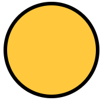
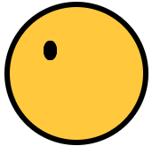

<div class="hidden">

> ## Rozcestník
> - [Späť na úvod](../../README.md)
> - Repo: [Štartér](/../../tree/main/css/css-smajliky), [Riešenie](/../../tree/solution/css/css-smajliky).

# Smajlíky (CSS)
</div>

## Riešenie
Na úvod riešenia začneme s analýzou problému. V zadaní máme 4 rôzne smajlíky. Tieto smajlíky majú tvar kruhu, ktorý vo všetkych 4 prípadoch obsahuje 2 oči a 1 ústa. Druhý a tretí smajlík obsahuje okolo základných úst navyše ďalšie grafické prvky.

### Úprava HTML kódu smajlika
V zadaní máme základnú kostru smajlíka, do ktorej si môžme pridať ďalšie prvky. Vzhľadom na potrebu troch ďalších častí si upravíme pripravené html nasledovne:

```html
<div class="smajlik">
  <span class="oko"></span>
  <span class="oko"></span>
  <span class="usta"></span>
</div>
```

Do kostry sme pridali ďalšie 3 elementy. Tieto elementy sú typu `span` a majú priradený atribút `class`. Prvé dva budú použité na zobrazenie očí a posledný bude slúžiť na zobrazenie úst. Element typu `span` je možné nahradiť aj iným elementom - napr. `div`. Z pohľadu funkčnosti samotného riešenia na konkrétnom type elementu nezáleží, nakoľko pomocou CSS je možné každý jeden element ľubovolne prispôsobiť.

Po spustení aktuálneho kódu však zatiaľ nič neuvidíme, nakoľko elementy neobsahujú žiaden textový obsah a css triedam sme ešte nepriradili žiadene pravidlá.

### Základne zobrazenie tela smajlíka
Na úvod začeneme s definíciou CSS pre základneho smajlíka vo veľkosti 50 x 50px.

Pokiaľ chceme aby html element mal definovanú pevnú veľkosť bez ohľadu na obsah musíme mu nastaviť výšku a šírku. Nastavenie výšky a šírky sa ale aplikuje len na elementy blokového typu. V našom prípade máme element `div`, ktorý patrí medzi blokové elementy, takže už nemusíme nastavovať nič navyše.
Okrem veľkosti nastavíme elementu aj farbu pozadia.
```css
.smajlik {
  width: 50px;
  height: 50px;
  background-color: #ffc83d;
}
```
Výsledkom tejto úpravy bude nasledovný štvorec o rozmeroch 50 x 50px;


V ďalšom kroku potrebujeme z tohto štvorčeka spraviť kruh. To vieme v ccs docieliť pomocou zaoblenia rámikov - vlastnosti `border-radius`. Okrem toho by bolo vhodné pridať aj čierne orámovanie, ktoré môžme aplikovať pomocou vlastnosti `border`. 

```css
border: black 2px solid;
border-radius: 50%;
```

Vlastnosť `border-radius` nastavuje veľkosť zaoblenia elementu. Táto veľkosť môže byť v pixeloch alebo aj v relatívnych hodnotách vzhľadom na veľkosť elementu. V našom prípade, nastavením tejto hodnoty na `50%` dosiahneme požadované zobrazenie elementu `div` ako kruhu.



### Zobrazenie očí
Po tom ako sme vytvorili kruh sa pustíme do štýlovania očí smajlíka. Pre oči máme v html kóde pripravené 2 elementy. Začneme tým že ich zobrazíme.

```css
.smajlik .oko {
  display: block;
  background-color: black;
  width: 10%;
  height: 15%;
  border-radius: 50%;
}
```

CSS kód pre oči je veľmi podobný ako pri celom tele smajlíka, obsahuje nastavenie farby pozadia, veľkosť a zaoblenie okrajov. Prvá odlišnosť, ktorú si môžte všimnúť je nastavenie vlastnosti `display` na hodnotu `block`. Ako sme už v predchádzajúcej časti spomínali, šírka a výška a aplikuje len na blokové elementy. Oko smajlíka používa html element `span` ktorý je inline elementom. Ak chceme, aby sa aj inline element zobrazil ako blokový, musíme mu nastaviť vlastnosť `display`.

Ďalšou odlišnosťou je nastavenie veľkosti očí. Pre nastavenie sme použili relatívne hodnoty pomocou percent. Toto nám umožní v budúcnosti jednoduhšiu zmenu veľkosti celého prvku.

Výsledok vyzerá nasledovne:


Ako môžme vidieť, oči sa na obrázku zobrazili v pravom hornom rohu pod sebou. Ďalším krokom bude umiestnenie týchto očí na správne miesto. To je možné dosiahnúť rôznymi spôsobmi. Napríklad sa dá použiť vlastnosť `transform` alebo pomocou absolútnej pozície.

```css
position: absolute;
left: 25%;
top: 25%; 
```

Opäť pri definícii použijeme relatívne jednotky. Ľavé oko bude na pozícii 25% od vrchu smajlíka a 25% od ľavej strany. Na to aby nám správne fungovala absolútna pozícia, nadradený element musí mať tiež nastavenú pozíciu - napríklad `relative`.
Do selektoru `.smajlik` preto pridáme ešte jednu vlastnosť:
```css
position: relative;
```

Po aplikovaní bude náš smajlík vyzerať nasledovne:

