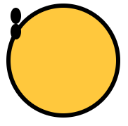
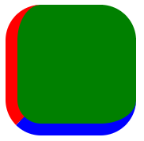

<div class="hidden">

> ## Rozcestník
> - [Späť na úvod](../../README.md)
> - Repo: [Štartér](/../../tree/main/css/css-smajliky), [Riešenie](/../../tree/solution/css/css-smajliky).

# Smajlíky (CSS)
</div>

## Riešenie
Na úvod riešenia začneme s analýzou problému. V zadaní máme 4 rôzne smajlíky. Tieto smajlíky majú tvar kruhu, ktorý vo všetkych 4 prípadoch obsahuje 2 oči a 1 ústa. Druhý a tretí smajlík obsahuje okolo základných úst navyše ďalšie grafické prvky.

### Úprava HTML kódu smajlika
V zadaní máme základnú kostru smajlíka, do ktorej si môžme pridať ďalšie prvky. Vzhľadom na potrebu troch ďalších častí si upravíme pripravené html nasledovne:

```html
<div class="smajlik">
  <span class="oko"></span>
  <span class="oko"></span>
  <span class="usta"></span>
</div>
```

Do kostry sme pridali ďalšie 3 elementy. Tieto elementy sú typu `span` a majú priradený atribút `class`. Prvé dva budú použité na zobrazenie očí a posledný bude slúžiť na zobrazenie úst. Element typu `span` je možné nahradiť aj iným elementom - napr. `div`. Z pohľadu funkčnosti samotného riešenia na konkrétnom type elementu nezáleží, nakoľko pomocou CSS je možné každý jeden element ľubovolne prispôsobiť.

Po spustení aktuálneho kódu však zatiaľ nič neuvidíme, nakoľko elementy neobsahujú žiaden textový obsah a cez css sme ešte nepriradili žiadene pravidlá.

### Základne zobrazenie tela smajlíka
Na úvod začeneme s definíciou CSS pre základneho smajlíka vo veľkosti 50 x 50px.

Pokiaľ chceme aby html element mal definovanú pevnú veľkosť bez ohľadu na obsah musíme mu nastaviť výšku a šírku. Nastavenie výšky a šírky sa ale aplikuje len na elementy blokového typu. V našom prípade máme element `div`, ktorý patrí medzi blokové elementy, takže už nemusíme nastavovať nič navyše. Pre lepšie zobrazenie - aby viaceré smajlíky boli zobrazené v rade vedľa seba, nie pod sebou, môžme ešte použiť špeciálny mód blokového zobrazenia - `display: inline-block`.

Okrem veľkosti nastavíme elementu aj farbu pozadia.
```css
.smajlik {
  display: inline-block;
  width: 50px;
  height: 50px;
  background-color: #ffc83d;
}
```
Výsledkom tejto úpravy bude nasledovný štvorec o rozmeroch 50 x 50px;


V ďalšom kroku potrebujeme z tohto štvorčeka spraviť kruh. To vieme v ccs docieliť pomocou zaoblenia rámikov - vlastnosti `border-radius`. Okrem toho by bolo vhodné pridať aj čierne orámovanie, ktoré môžme aplikovať pomocou vlastnosti `border`. 

```css
border: black 2px solid;
border-radius: 50%;
```

Vlastnosť `border-radius` nastavuje veľkosť zaoblenia elementu. Táto veľkosť môže byť v pixeloch alebo aj v relatívnych hodnotách vzhľadom na veľkosť elementu. V našom prípade, nastavením tejto hodnoty na `50%` dosiahneme požadované zobrazenie elementu `div` ako kruhu.


### Zobrazenie očí
Po tom ako sme vytvorili kruh sa pustíme do štýlovania očí smajlíka. Pre oči máme v html kóde pripravené 2 elementy. Začneme tým že ich zobrazíme.

```css
.smajlik .oko {
  display: block;
  background-color: black;
  width: 10%;
  height: 15%;
  border-radius: 50%;
}
```

CSS kód pre oči je veľmi podobný ako pri celom tele smajlíka, obsahuje nastavenie farby pozadia, veľkosť a zaoblenie okrajov. Prvá odlišnosť, ktorú si môžte všimnúť je nastavenie vlastnosti `display` na hodnotu `block`. Ako sme už v predchádzajúcej časti spomínali, šírka a výška a aplikuje len na blokové elementy. Oko smajlíka používa html element `span` ktorý je inline elementom. Ak chceme, aby sa aj inline element zobrazil ako blokový, musíme mu nastaviť vlastnosť `display`.

Ďalšou odlišnosťou je nastavenie veľkosti očí. Pre nastavenie sme použili relatívne hodnoty pomocou percent. Toto nám umožní v budúcnosti jednoduhšiu zmenu veľkosti celého prvku. Veľkosť očí sme nastavili na 10% a 15%, vďaka čomu oči nebudú mať úplne kruhový tvar, ale budú zvislo natiahnuté.

Výsledok vyzerá nasledovne:



Ako môžme vidieť, oči sa na obrázku zobrazili v pravom hornom rohu pod sebou. Ďalším krokom bude umiestnenie týchto očí na správne miesto. To je možné dosiahnúť rôznymi spôsobmi. Napríklad sa dá použiť vlastnosť `transform` alebo pomocou absolútnej pozície.

```css
position: absolute;
left: 25%;
top: 25%; 
```

Opäť pri definícii použijeme relatívne jednotky. Ľavé oko bude na pozícii 25% od vrchu smajlíka a 25% od ľavej strany. Na to aby nám správne fungovala absolútna pozícia, nadradený element musí mať tiež nastavenú pozíciu - napríklad `relative`.
Do selektoru `.smajlik` preto pridáme ešte jednu vlastnosť:
```css
position: relative;
```

Po aplikovaní bude náš smajlík vyzerať nasledovne:


Ako môžme vidieť, na obrázku máme zobrazené len jedno oko. Je to z toho dôbovu, že obe oči majú rovnakú css triedu a sú umiestnené pomocou absolútneho poziciovania - takže sa prekrývajú. Aby sme oči zobrazili správne, musíme jedno z nich posunúť do prava. 
Možností máme niekoľko, buďto druhému oku pridáme ďalšiu CSS triedu alebo použijeme niektorý zo selektorov `:last-child`, `:nth-child(n)`, `:first-child`...

V našom prípade môžme pomocou selektoru `:last-child` "vybrať" druhé oko a posunúť ho viac doprava. Výsledný kód bude vyzerať nasledovne:

```css
.smajlik .oko:first-child {
  left: 65%;
}
```

Pomocou selektoru `.smajlik .oko:first-child` sme zvolili posledný element s triedou `oko`, ktorý sa nachádza ľubovolne zanorený v elemente s triedou `smajlik`. Tento selektor len dopĺňa (prepisuje) už doteraz definované vlasnoti pre element s triedou `oko` takže nemusíme opakovať nastavenie veľkosti farby atď. Jediná zmena, ktorú sme urobili opriti pôvodnému nastaveniu elementu `oko` bola pozícia z ľava, ktorú sme v tomto prípade nastavili na 75%. Výsledný smajlík bude vyzerať nasledovne:


### Zobrazenie úst
Pre zobrazenie úst máme k dispozící html element s triedou `usta`. Začneme tým, že si tento element zobrazíme, nastavíme mu veľkosť a pozíciu.

```css
.smajlik .usta {
  background-color: black;
  width: 60%;
  height: 60%;
  display: block;
  position: absolute;
  top: 10%;
  left: 20%;
}
```

Veľkosť sme nastavili na 60% z rozmeru smajlíka. Následne sme element napoziciovali tak, aby sa zobrazil v stede. Ak vieme že šírka elementu je 60% tak na to, aby sa zobrazil vycentrovaný ho musíme zobraziť 20% od ľavej strany smajlíka.
Po aplikovaní týchto pravidiel dostaneme nasledovný tvar:


Ústa na vzorovom obrázku získame tak, že z tohto elementu spravíme kruh pomocou `border-radius`, zobrazíme spodné orámovanie a zrušíme výplň.

```css 
.smajlik .usta {
  background-color: transparent;
  border-bottom: 2px solid black;
  border-radius: 50%;
}
```


Výsledok sa už takmer podobá zadaniu, ibaže naše ústa nemajú pevné ohraničenie ale idú "do stratena". Tento efekt je spôsobený tým, ako fungujú orámovania. Ak máme orámovanie len na jednej strane, toto orámovanie sa pri zaoblených elementoch na krajoch tzv. zlieva.

Pre lepšie pochopenie uvedieme ďalšiu ukážku. Máme nasledovný CSS kód:
```css
.demo {
  width: 50px;
  height: 50px;
  background: green;
  border-bottom: 5px solid blue;
  border-left: 5px solid red;
  border-radius: 15px;
}
```

Tento kód naštýluje zelený obdĺžnik o rozmeroch 50x50px. Tento obdĺžnik má zaoblenie 15px. Okrem toho sme definovali orámovanie o veľkosti 5px z ľavej a spodnej strany. Ako môžme vidieť na obrázku nižšie, prechod medzi rámikom v ľavo dole je pevný. Naopak v ľavo hore, respektíve v pravo dole je tento prechod plynulý.



V našom smajlíkovi potrebujeme nastaviť zvyšné rámiky na rovnakú šírku ako má spodný, ale s tým, že tieto budú priesvitné.

```css 
.smajlik .usta {
  border: 2px solid transparent;
  border-bottom: 2px solid black;
}
```

Po úprave týchto pravidiel vznikne ešte jeden problém.


Ústa sú posunuté mimo stredu na pravo. Tento problém je spôsobený tým, že veľkosť nášho elementu pre ústa sa zväšila o šírku rámikov. To znamená že aktuálne má náš element skutočnú šírku 60% + 5px rámik z prava + 5px rámik z ľava. Tento problém môžme vyriešiť viacerími spôsobmi. Môžme napríklad tento posun kompenzovať v css vlastnosti `left` tak, že odrátame tých 10px čo máme navyše. Druhým, oveľa lepším spôsobom je zmena vlastnosti `box-sizing` ktorá definuje ako sa určuje veľkosť elementu. V základe sa do veľkosti nepočíta veľkosť rámiku. Toto ale môžme zmeniť nastavením tejto vlastnosti na hodnotu `border-box`.

Výsledné CSS hotového smajlíka bude vyzerať nasledovne:
```css 
.smajlik .usta {
  box-sizing: border-box;
  background-color: transparent;
  width: 70%;
  height: 70%;
  border: 2px solid transparent;
  border-bottom: 2px solid black;
  border-radius: 50%;
  display: block;
  position: absolute;
  top: 10%;
  left: 15%;
}
```

Okrem pridania vlastnosti `box-sizing` sme upravili pozíciu tak, že ústa sme posunuli 10% od vrchu, 15% z ľava. Zmenili sme aj celkovú veľkosť úst na 70%, pretože teraz rozmer úst teraz zahŕňa aj orámovanie.


### Vytvorenie smutného smajlíka
Smutný smajlík sa od toto základného líši len v tom, že má ústa obrátené naopak. Táto zmena bude veľmi jednoduchá, pretože nám stačí namiesto spodného orámovania úst zobraziť horné, a posunúť ústa na správne miesto. 

```css
.smajlik.smutny .usta {
  border: 2px solid transparent;
  border-top: 2px solid black;
  top: 60%;
}
```

Druhou možnosťou je využitie CSS transofmácií, kde je potrebné element zrotovať o 180 stpňov a presunúť ho na správne miesto.
```css
.smajlik.smutny .usta {
  transform: rotate(180deg) translateY(-80%);
}
```

Výsledok oboch príkladov je totožný.


Html kód pre zobrazenie tohto smajlíka je podľa zadania nasledovný:
```html
<div class="smajlik smutny">
  <span class="oko"></span>
  <span class="oko"></span>
  <span class="usta"></span>
</div>
```

Na to, aby sme upravili ústa len pri smajlíkovi, ktorý má aj triedu `smutny` sme použili selektor `.smajlik.smutny .usta`. Všimnite si, že medzi `.smajlik` a `.smutny` nieje medzera, takže tento selektor sa aplikuje len na smajlíka, ktorý bude mať nastavené obe tieto triedy.

### Vytvorenie smajlíka s líčkami
Ďalším smajlíkom v zadaní bol smajlík s líčkami. Ako základ budeme opäť vychádzať z pôvodného smajlíka. Zmena oproti pôvodnému smajlíku spočíva v tom, že tento má ešte za úsmevom zobrazené ružové krúžky.

Jedným z riešení by bola úprava html štruktúry smajlíka ale chceme dodržať rovnakú štruktúru pre všetkých takže toto riešenie nepripadá v úvahu.

Html kód nášho smajlíka s líčkami musí vyzerať nasledovne:
```html
<div class="smajlik licka">
  <span class="oko"></span>
  <span class="oko"></span>
  <span class="usta"></span>
</div>
```

Pre zobrazenie líčok môžme využiť pseudoselektory `::before` a `::after` ktoré nám umoňujú pridať ďalšie pseudoelementy na začiatok a koniec určitého elementu. 

Líčko na ľavo zobrazíme cez selektor `::before` a nastavíme mu veľkosť rovnú 30% z veľkosti úst. Okrem toho mu nastavíme farbu, `border-radius` a pozíciu podobne, ako pri ostatných prvkoch.
```css
.smajlik.licka .usta::before {
  position: absolute;
  content: "";
  background-color: #f7894a;
  width: 30%;
  height: 30%;
  border-radius: 50%;
  bottom: 5%;
  left: -5%;
}
```
V CSS si môžme všimnúť jednu zaujímavú vlastnosť. Vlastnosť `content` slúži na nastavenie textového obsahu pseudoelementu. V našom prípade tam nastavíme prázdny reťazec, pretože nič viac nepotrebujeme. Ak by sme `content` nezadefinovali, pseudoelement by sa nám nezobrazil vôbec. Výsledok si môžme pozrieť na nasledovnom obrázku.


Problémom tohto riešenia je to, že líčko nám prekrýva ústa. Chceli by sme teda zmeniť poradie týchto elementov. Keď vytvoríme nejaký peseudoelement pomocou `::before` alebo `::after` tak tento element je potomkom elementu, ku ktorému ho vytvárame.

```html
<div class="smajlik licka">
  <i class="oko"></i>
  <i class="oko"></i>
  <span class="usta">
    ::before
  </span>
</div>
```

Na zmenu poradia poradia elementov môžme využiť CSS vrstvy - vlastnosť `z-index`. Pre správne fungovanie musíme nastaviť nášmu líčku hodnotu `z-index: -1`. Po pridaní tejto vlastnosti sa nám celé líčko stratí. Aby bolo správne zobrazené, musíme nastaviť `z-index` aj nadradenému prvku. V tomto prípade nepomôže nastavenie hodnoty `z-index` prvku `usta` ale musíme ju nastaviť celému smajlíku.

```css
.smajlik {
  z-index: 1;
}

.smajlik.licka .usta::before {
  z-index: -1;
}
```

Po aplikovaní týchto pravidiel dosiahneme správne zobrazenie líčka.


Posledným krokom bude zobrazenie druhého líčka pomocou `::after`. Obe líčka majú veľa spoločných pravidiel. Výsledný kód upravíme tak, že spoločné pravidlá definujeme len raz a pozíciu nastavíme každému samostantne.

```css
.smajlik.licka .usta::before, .smajlik.licka .usta::after {
  position: absolute;
  content: "";
  background-color: #f7894a;
  width: 30%;
  height: 30%;
  border-radius: 50%;
  bottom: 5%;
  z-index: -1;
}

.smajlik.licka .usta::before {
  left: -5%
}

.smajlik.licka .usta::after {
  right: -5%
}
```

Môžme si všimnúť že prvý selektor obsahuje dve časti oddelené čiarkou. Tento zápis v CSS znamená, že pravidlo platí pre každý z daných selektorov.

Výsledok bude vyzerať nasledovne:


### Vytvorenie veselého smajlíka
Pri vytváraní veselého smajlíka musíme zmeniť viacero veci. Prvou z nich je vykreslenie úst. V predchádzajúcich príkaladoch sme používali na vykreslenie úst zaoblené orámovanie, ktoré zobrazilo štvrť-kruh s daným polomerom. Pri veselom smajlíkovi potrebujeme celý polkruh, navyše ešte aj vyplnený. Ak chceme získať vyplnený polkruh, tak už nám nebude stačiť vykresliť vhodne ohnutý rámik, ale budeme musieť celý element transformovať na polkruh. Na túto transformáciu využijeme vlastnosti `border-bottom-left-radius` a `border-bottom-right-radius`. Tie umožnujú presnejšie špecifikovať oblúk na okrajoch elementu.

Začneme teda s CSS kódom, ktorý vyzerá nasledovne:
```css
.smajlik.vesely .usta {
  background: black;
  height: 20%;
  width: 50%;
  top: 60%;
  left: 25%;
  border-bottom-left-radius: 100% 200%;
  border-bottom-right-radius: 100% 200%;
}
```

Pomocou tohto CSS nastavíme elementu čiernu farbu pozadia. Následne upravíme primerane veľkosť a pozíciu týchto úst. Posledné dve pravidlá nastavujú nové zaoblenie úst. Aj pravý aj ľavý spodný roh má nastavené zaoblenie na `100% 200%`. Výsledok bude nasledovný:


Ako vidíme, ústa sú zaoblené aj z vrchu. Toto zaoblenie je spôsobené pravidlami pre ústa pôvodného smajlíka. Pomocou `border-radius: 0;` ostránime pôvodné zaoblenie úst. Pozor, toto pravidlo musí byť vo výslednom CSS umiestnené pred pravidlami `border-bottom-left-radius` a `border-bottom-right-radius`.


V ďalšom kroku skúsime smajlíkovi pridať zuby. Na to môžme použiť opäť pseudoelementy `::before` a `::after`.

```css
.smajlik.vesely .usta::before {
  position: absolute;
  display: block;
  content: "";
  background: white;
  width: 100%;
  height: 25%;
  top: 20%;
}
```

Po aplikovaní štýlu bude náš smajlík vyzerať nasledovne:


Smajlík síce zuby má, ale tie sa vykreslujú nad ústami. Pokiaľ chceme aby boli zuby "vo vnútri", môžme použiť vlastnosť `overflow`, ktorú pre `.smajlik.vesely .usta` nastavíme na `hidden`.


Posledným krokom je pridanie jazyka. Jazyk môžeme implementovať ako polkruh kruh, ktorý umiestnime na spodnú stranu. Pri jazyku môžme využiť to, že celé ústa majú nastavené `overflow` na `hidden` a nemusíme sa tak trápiť s polkruhom ale môžme použiť plný kruh, ktorého spodná čas bude skrytá.

```css
.smajlik.vesely .usta::after {
  position: absolute;
  display: block;
  content: "";
  background: #f03a17;
  width: 50%;
  height: 50%;
  border-radius: 50%;
  left: 25%;
  bottom: -25%;
}
```


### Definícia ďalších rozmerov

Ďalšie rozmery smajlíka budeme definovať pomocou css tried `s-100`, `s-250` a `s-500`.
Na pri vytváraní smajlíkov sme využívali relatívne rozmery, tak by mohlo stačiť jednotlivé triedy deklarovať nasledovne:

```css
.smajlik.s-250 {
  width: 250px;
  height: 250px;
}
```

Výsledok vyzerá nasledovne:


Veľkosť smajlíka je v poriadku ale veľký smajlík má tenké rámiky. Keď sa bližšie pozrieme na CSS pravidlá, ktoré deklarujú orámovanie, môžme vidieť nasledovné:
```css
.smajlik {
  border: black 2px solid;
}
```
Pri vlastnosti `border` sme nepoužili relatívne jednotky ale pixely. Je to z toho dôvodu, že `border` nepodporuje percentá. Zmena veľkosti tým pádom nepôjde len zmenov rozmerov smajlíka.

Namiesto zmeny rozmerov môžme použiť CSS transformácie. Konkrétne transformáciu `scale`.

```css
.smajlik.s-100 {
  transform: scale(2);
}
```
Výsledok bude vyzerať nasledovne:


Najväčší smajlík má správnu veľkosť orámovanie, ale ako môžme vidieť, pôvodne tri smajlíky sú aktuálne zobrazené cez seba. Môžme ešte skúsiť nastaviť `transform-origin` na `top left` (ľavý horný roh), ale to nám tiež moc nepomôže.


Css transformácie síce menia výzor elementu, ale nemenia jeho pozíciu a rozmer vzhľadom na iné elementy. To znamená, že ak aj zmeníme veľkosť druhého smajlíka 2x, tak z pohľadu tretieho sa javý nezmenený a preto ho prekryje. Tento problém sa dá vyriešiť pridaním marginov.

```css
.smajlik.s-100 {
  transform: scale(2);
  margin: 25px;
}
```

V tomto prípade už nepotrebujeme nastaviť `transform-origin`, pretože jeho východzia hodnota je `center center`. Ak teda zväčšíme smajlíka 50x50px 2x tak na každej strane bude potrebné pridať margin 25px. Výsledný obrázok vyzerá nasledovne:


### Definícia rozmeru cez CSS premenné
Riešenie viacerých rozmerov cez transformácie nieje jediným spôsobom. CSS preprocessory (SASS, LESS) používajú na podobné úkony premenné ako v bežných programovacích jazykov. Premené je možné používať aj v čistom CSS.

Definíciu základného smajlíka môžme upraviť nasledovne:
```css
.smajlik {
  --size: 50px;
  display: inline-block;
  position: relative;
  width: var(--size);
  height: var(--size);
  background-color: #ffc83d;
  border: black calc(var(--size)/25) solid;
  border-radius: 50%;
  z-index: 1;
}
```

Do deklarácie sme pridali CSS premennú `--size` ktorej hodnotu sme nastavili na 50px. Pokiaľ chceme použiť túto premennú ako hodnotu nejakej vlastnosti, musíme použiť funkciu `var`. Ďalšia zaujímavá funkcia, ktorú sme v tomto príklade použili je funkcia `calc`. Táto funkcia slúži na výpočet hodnoty. V našom prípade bude šírka orámovania vypočítaná ako veľkosť elementu deleno 25.
Rovnakú premennú môžme používať vo všetkých potomkoch smajlíka, takže upravíme veľkosť orámovania aj pre ústa nasledovne:

```css
.smajlik .usta {
  border: calc(var(--size)/25) solid transparent;
  border-bottom: calc(var(--size)/25) solid black;
}

.smajlik.smutny .usta {
  border: calc(var(--size)/25) solid transparent;
  border-top: calc(var(--size)/25) solid black;
}
```

Definícia jednotlivých veľkostí bude spočívať v jednoduchom prepísaní hodnoty tejto premennej.

```css
.smajlik.s-100 {
  --size: 100px;
}
```

Dokonca môžme spraviť smajlíka ľubovolnej veľkosti aj priamo v html kóde:
```html
<div class="smajlik" style="--size: 25px">
  <i class="oko"></i>
  <i class="oko"></i>
  <span class="usta"></span>
</div>
```