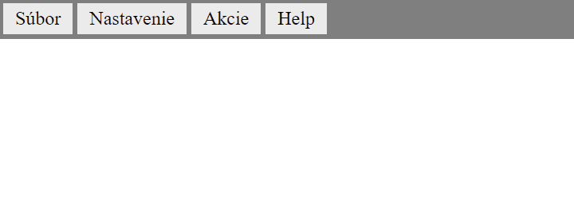

<div class="hidden">

> > ## Rozcestník
> - [Späť na úvod](../../README.md)
> - Repo: [Štartér](/../../tree/main/css/dropdownmenu), [Riešenie](/../../tree/solution/css/dropdownmenu).
</div>

# DropDown a DropUp menu (CSS)

## Zadanie
Cieľom úlohy je vytvoriť roletové menu aké obsahujú bežne desktopové aplikácie. Ako má menu fungovať demonštruje nasledovný gif:



Menu musí spĺňať nasledovné:

1. Prvá úroveň je vždy zobrazená na vrchu stránky
2. Ďalšie úrovne menu sú viditeľne iba ak ich používateľ aktivuje kurzorom (viď. gif hore)
3. Vizuálne indikujte či daná položka obsahuje sub-menu
4. Zvýraznite, aké položky menu sú aktivované (viď. gif hore – zvýraznenie na žlto)
5. Jednotlivé sub-menu zobrazte s jemne odlišnou farbou pozadia. Napr. stmavovaním (viď. gif hore).
6. Modifikujt drop-down menu na drop-up menu.


Počiatočný `HTML` dokument obsahuje menu zadefinované pomocou štruktúry elementov a vyzerá nasledovne:

```html
 <div id="menu">
        <ul>
            <li>
                <span>Súbor</span>
                <ul>
                    <li>
                        <span>Vytvoriť nový</span>
                        <ul>
                            <li><span>PDF</span></li>
                            <li><span>PPT</span></li>
                            <li><span>TXT</span></li>
                            <li><span>HTML</span></li>
                        </ul>
                    </li>
                    <li><span>Uložiť</span></li>
                    <li>
                        <span>Exportovať</span>
                        <ul>
                            <li>
                                <span>Web</span>
    ...
```

Všimnite si však, že samotné `<ul>` a `<li>` definujú _iba_ štruktúru. Obsah položky je definované ako obsah `<span>`. Vnorenie jednotlivých `<ul>` v `<li>` definuje ktorý `<ul>` je sub-menu ktorého menu.

Pre riešenie použite výlučne iba CSS.

<div class="hidden">

[Zobraziť riešenie](riesenie.md)
</div>