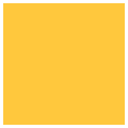
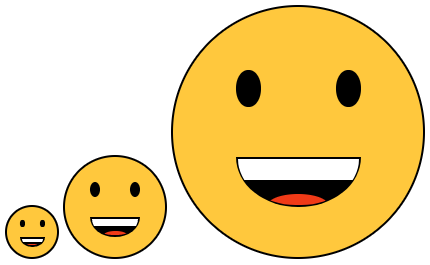

<div class="hidden">

> ## Rozcestník
> - [Späť na úvod](../../README.md)
> - Repo: [Štartér](/../../tree/main/css/emoticons), [Riešenie](/../../tree/solution/css/emoticons)
> - [Zobraziť zadnie](zadanie.md)
# Emotikony (CSS)

</div>

## Riešenie

Na úvod riešenia začneme s analýzou problému. V zadaní máme štyri rôzne emotikony. Tieto emotikony majú tvar kruhu, ktorý vo všetkých štyroch prípadoch obsahuje dve oči a jedny ústa. Druhý a tretí emotikon obsahuje okolo základných úst navyše ďalšie grafické prvky.

### Úprava HTML kódu emotikona

V zadaní máme základnú kostru emotikona, do ktorej si môžeme pridať ďalšie prvky. Vzhľadom na potrebu troch ďalších častí si upravíme pripravené HTML takto:

```html
<div class="smiley">
    <span class="eye"></span>
    <span class="eye"></span>
    <span class="mouth"></span>
</div>
```

Do kostry sme pridali ďalšie tri elementy. Tieto elementy sú typu `span` a majú priradený atribút `class`. Prvé dva budú použité na zobrazenie očí a posledný bude slúžiť na zobrazenie úst. Element typu `span` je možné nahradiť aj iným elementom - napr. `div`. Z&nbsp;pohľadu funkčnosti samotného riešenia na konkrétnom type elementu nezáleží, nakoľko pomocou CSS je možné každý jeden element ľubovoľne prispôsobiť.

Po spustení aktuálneho kódu však zatiaľ nič neuvidíme, nakoľko elementy neobsahujú žiaden textový obsah a cez CSS sme im ešte nepriradili žiadne pravidlá.

#### Základné zobrazenie tela emotikona

Na úvod začneme s definíciou CSS pre základného emotikona vo veľkosti `50px` x `50px`.

Pokiaľ chceme, aby element mal definovanú pevnú veľkosť bez ohľadu na obsah, musíme mu nastaviť výšku a šírku. Nastavenie výšky a šírky sa ale aplikuje len na elementy blokového typu. V našom prípade máme ako rodičovský element `div`, ktorý patrí medzi blokové elementy, takže už nemusíme nastavovať nič navyše. Viaceré emotikony chceme zobraziť v rade vedľa seba, nie pod sebou, použijeme špeciálny mód blokového zobrazenia pomocou CSS vlastnosti `display: inline-block`.

Okrem veľkosti nastavíme elementu aj farbu pozadia.

```css
.smiley {
    display: inline-block;
    width: 50px;
    height: 50px;
    background-color: #ffc83d;
}
```

Výsledkom tejto úpravy bude nasledujúci štvorec o rozmeroch `50px` x `50px`.



V ďalšom kroku potrebujeme zo štvorčeka spraviť kruh. To docielime pomocou zaoblenia rámčekov - použitím CSS vlastnosti `border-radius`. Okrem toho by bolo vhodné pridať aj čierne orámovanie, ktoré môžeme aplikovať pomocou CSS vlastnosti `border`.

```css
.smiley {
    border: black 2px solid;
    border-radius: 50%;
}
```

CSS vlastnosť `border-radius` nastavuje zaoblenie rámčeka. Hodnota môže byť uvedená v&nbsp;pixeloch alebo v relatívnych hodnotách vzhľadom na veľkosť elementu. V našom prípade nastavením hodnoty na `50%` dosiahneme zobrazenie elementu `div` ako kruhu.


#### Zobrazenie očí

Po vytvorení kruhu sa pustíme do štýlovania očí emotikona. Pre oči máme v HTML kóde pripravené dva elementy `span` s atribútom `class="eye"`. Začneme tým, že ich zobrazíme.

```css
.smiley .eye {
    display: block;
    background-color: black;
    width: 10%;
    height: 15%;
    border-radius: 50%;
}
```

CSS pre naštýlovanie očí je veľmi podobné ako pri celom tele emotikona. Obsahuje nastavenie farby pozadia, veľkosti a zaoblenia okrajov. 

Prvá odlišnosť, ktorú si môžete všimnúť, je nastavenie CSS vlastnosti `display` na hodnotu `block`. Ako sme už spomínali, šírka a výška sa aplikuje len na blokové elementy. Oko emotikona používa HTML element `span`, ktorý je riadkovým elementom. Ak chceme, aby sa aj riadkový element zobrazil ako blokový, musíme mu zmeniť vlastnosť `display`.

Ďalšou odlišnosťou je nastavenie veľkosti očí. Pre nastavenie sme použili relatívne hodnoty pomocou percent. Toto nám umožní v budúcnosti jednoduchšiu zmenu veľkosti celého prvku. Veľkosť očí sme nastavili na `10%` a `15%`, vďaka čomu oči nebudú mať úplne kruhový tvar, ale budú zvislo natiahnuté.

Výsledok vyzerá nasledujúco:


Ako môžeme vidieť, oči sa na obrázku zobrazili v pravom hornom rohu pod sebou. Ďalším krokom bude umiestnenie týchto očí na správne miesto. To je možné dosiahnuť rôznymi spôsobmi. Napríklad sa dá použiť vlastnosť `transform`, alebo nastaviť absolútnu pozíciu.

```css
.smiley .eye {
    position: absolute;
    left: 25%;
    top: 25%;
}
```

Opäť pri definícii použijeme relatívne jednotky. Ľavé oko bude na pozícii 25% od vrchu emotikona a 25% od ľavej strany. Na to, aby nám správne fungovala absolútna pozícia, musí mať nadradený element nastavenú pozíciu napr. na `relative`. Do selektora `.smiley` preto pridáme ešte jednu vlastnosť:

```css
.smiley {
    position: relative;
}
```

Po aplikovaní pravidla bude náš emotikon vyzerať:


Ako môžeme vidieť, na obrázku máme zobrazené len jedno oko. Je to z toho dôvodu, že obe oči majú rovnakú CSS triedu a sú umiestnené pomocou absolútneho poziciovania a prekrývajú sa. Aby sme oči zobrazili správne, musíme jedno z nich posunúť doprava. Možností máme niekoľko, buď druhému oku pridáme ďalšiu CSS triedu, alebo použijeme niektorý zo selektorov `:last-child`, `:nth-child(n)`, `:first-child`, a pod.

V našom prípade môžeme pomocou selektora `:first-child` vybrať prvé oko a posunúť ho viac doprava. Výsledné CSS bude vyzerať takto:

```css
.smiley .eye:first-child {
    left: 65%;
}
```

Pomocou selektora `.smiley .eye:first-child` sme zvolili prvý element s triedou `eye`, ktorý sa nachádza ľubovolne vnorený v elemente s triedou `smiley`. Tento selektor len dopĺňa (prepisuje) už doteraz definované vlastnosti pre element s triedou `eye`, takže nemusíme opakovať nastavenie veľkosti farby atď. Jediná zmena, ktorú sme urobili oproti pôvodnému nastaveniu elementu `eye`, bola pozícia zľava a tu sme nastavili na `75%`. Výsledný emotikon bude vyzerať nasledujúco:


Nabádalo by sa aj použitie CSS pseudotriedy `:last-child`, ale tá v tomto prípade nefunguje, pretože posledný element v emotikone nemá triedu `.eye`, ale `.mouth`, a tým pádom by sme nevybrali žiadny element.

#### Zobrazenie úst

Pre zobrazenie úst máme k dispozícii HTML element s triedou `mouth`. Začneme tým, že si tento element zobrazíme a nastavíme mu veľkosť a pozíciu:

```css
.smiley .mouth {
    background-color: black;
    width: 60%;
    height: 60%;
    display: block;
    position: absolute;
    top: 10%;
    left: 20%;
}
```

Veľkosť sme nastavili na `60%` z rozmeru emotikona. Následne sme element umiestnili tak, aby sa zobrazil v strede. Ak vieme, že šírka elementu je `60%`, tak na to, aby sa zobrazil vycentrovaný, musíme ho zobraziť `20%` od ľavej strany emotikona. Po aplikovaní týchto pravidiel dostaneme nasledujúci tvar:


Ústa na vzorovom obrázku získame tak, že z tohto elementu spravíme kruh pomocou `border-radius`, zobrazíme spodný rámček a zrušíme výplň.

```css
.smiley .mouth {
    background-color: transparent;
    border-bottom: 2px solid black;
    border-radius: 50%;
}
```


Výsledok sa už takmer podobá zadaniu, ibaže naše ústa nemajú pevné ohraničenie, ale idú "do stratena". Tento efekt je spôsobený tým, ako fungujú rámčeky. Ak máme rámček len na jednej strane, tento rámček sa pri zaoblených elementoch na krajoch tzv. zlieva.

Pre lepšie pochopenie uvedieme ďalšiu ukážku. Máme nasledujúci CSS kód:

```css
.demo {
    width: 50px;
    height: 50px;
    background: green;
    border-bottom: 5px solid blue;
    border-left: 5px solid red;
    border-radius: 15px;
}
```

Tento kód naštýluje zelený obdĺžnik o rozmeroch `50px` x `50px`. Tento obdĺžnik má zaoblenie `15px`. Okrem toho sme definovali rámček o veľkosti `5px` z ľavej a spodnej strany. Ako môžeme vidieť na obrázku nižšie, prechod medzi rámčekom vľavo dole je pevný. Naopak vľavo hore, resp. vpravo dole, je tento prechod plynulý.


V našom emotikone potrebujeme nastaviť zvyšné rámčeky na rovnakú šírku ako má spodný, ale s tým, že tieto budú priesvitné:

```css
.smiley .mouth {
    border: 2px solid transparent;
    border-bottom: 2px solid black;
}
```

Po úprave týchto pravidiel vznikne ešte jeden problém.


Ústa sú posunuté mimo stredu napravo. Tento problém je spôsobený tým, že veľkosť nášho elementu pre ústa sa zväčšila o šírku rámčekov. To znamená, že aktuálne má náš element skutočnú šírku `60%` + `2px` rámček sprava + `2px` rámček zľava. Tento problém môžeme vyriešiť viacerými spôsobmi. 

Môžeme napríklad tento posun kompenzovať v CSS vlastnosti `left` tak, že odrátame `4px`, čo máme navyše. Druhým, oveľa lepším spôsobom, je zmena vlastnosti `box-sizing`, ktorá definuje, ako sa určuje veľkosť elementu. Potom sa do veľkosti nepočíta veľkosť rámčeka. Toto môžeme zmeniť nastavením tejto vlastnosti na hodnotu `border-box`.

Výsledné CSS hotového emotikona bude vyzerať nasledujúco:

```css
.smiley .mouth {
    box-sizing: border-box;
    background-color: transparent;
    width: 70%;
    height: 70%;
    border: 2px solid transparent;
    border-bottom: 2px solid black;
    border-radius: 50%;
    display: block;
    position: absolute;
    top: 10%;
    left: 15%;
}
```

Okrem pridania vlastnosti `box-sizing` sme upravili pozíciu tak, že ústa sme posunuli `10%` od vrchu, `15%` zľava. Zmenili sme aj celkovú veľkosť úst na `70%`, pretože teraz rozmer úst teraz zahŕňa aj rámček.


### Vytvorenie smutného emotikona

Smutný emotikon sa od toto základného líši len v tom, že má ústa obrátené naopak. Táto zmena bude veľmi jednoduchá, pretože nám stačí namiesto spodného rámčeka úst zobraziť horné a posunúť ústa na správne miesto.

```css
.smiley.sad .mouth {
    border: 2px solid transparent;
    border-top: 2px solid black;
    top: 60%;
}
```

Druhou možnosťou je využitie CSS transformácií, kde je potrebné element otočiť o 180 stupňov a presunúť ho na správne miesto.

```css
.smiley.sad .mouth {
    transform: rotate(180deg) translateY(-80%);
}
```
<div style="page-break-after: always;"></div>

Výsledok oboch príkladov je totožný:


HTML kód na zobrazenie tohto emotikona je podľa zadania nasledujúci:

```html
<div class="smiley sad">
    <span class="eye"></span>
    <span class="eye"></span>
    <span class="mouth"></span>
</div>
```

Na to, aby sme upravili ústa len pri emotikone, ktorý má aj triedu `sad`, sme použili selektor `.smiley.sad .mouth`. Všimnite si, že medzi `.smiley` a `.sad` nie je medzera, takže tento selektor sa aplikuje len na emotikona, ktorý bude mať nastavené obe tieto triedy.

### Vytvorenie emotikona s líčkami

Ďalším emotikonom v zadaní bol emotikon s líčkami. Ako základ budeme opäť vychádzať z pôvodného emotikona. Zmena oproti pôvodnému emotikonu spočíva v tom, že tento má ešte za úsmevom zobrazené ružové krúžky.

Jedným z riešení by bola úprava HTML štruktúry emotikona, ale chceme dodržať rovnakú štruktúru pre všetkých, takže toto riešenie nepripadá do úvahy.

HTML kód nášho emotikona s líčkami musí vyzerať takto:

<div class="end">

```html
<div class="smiley cheeks">
    <span class="eye"></span>
    <span class="eye"></span>
    <span class="mouth"></span>
</div>
```
</div>

Pre zobrazenie líčok môžeme využiť pseudoelementy `::before` a `::after`, ktoré nám umožňujú formátovať virtuálne elementy pridané na začiatok a koniec určitého elementu.

Líčko naľavo zobrazíme cez pseudoelement `::before` a nastavíme mu veľkosť rovnú `30%` z&nbsp;veľkosti úst. Okrem toho mu nastavíme farbu, `border-radius` a pozíciu podobne ako pri ostatných prvkoch.

```css
.smiley.cheeks .mouth::before {
    position: absolute;
    content: "";
    background-color: #f7894a;
    width: 30%;
    height: 30%;
    border-radius: 50%;
    bottom: 5%;
    left: -5%;
}
```

V CSS si môžeme všimnúť jednu zaujímavú vlastnosť. Vlastnosť `content` slúži na nastavenie textového obsahu pseudoelementu. V našom prípade tam nastavíme prázdny reťazec, pretože nič viac nepotrebujeme. Ak by sme `content` nedefinovali, pseudoelement by sa nám nezobrazil vôbec. Výsledok si môžeme pozrieť na nasledujúcom obrázku: 


Problémom tohto riešenia je to, že líčko nám prekrýva ústa, preto by sme chceli zmeniť poradie týchto elementov. Keď vytvoríme nejaký peseudoelement pomocou `::before` alebo `::after`, tak tento element je potomkom elementu, pre ktorý ho vytvárame.

```html
<div class="smiley cheeks">
    <i class="eye"></i>
    <i class="eye"></i>
    <span class="mouth">
    ::before
  </span>
</div>
```

Na zmenu poradia elementov môžeme využiť CSS vlastnosť `z-index` (vrstvenie). Pre správne fungovanie musíme nastaviť nášmu líčku hodnotu `z-index: -1`. Po pridaní tejto vlastnosti sa nám celé líčko stratí. Aby bolo správne zobrazené, musíme nastaviť `z-index` aj nadradenému prvku. V tomto prípade nepomôže nastavenie hodnoty `z-index` prvku `mouth`, ale musíme ju nastaviť celému emotikonu.

```css
.smiley {
    z-index: 1;
}
.smiley.cheeks .mouth::before {
    z-index: -1;
}
```

Po aplikovaní týchto pravidiel dosiahneme správne zobrazenie líčka.


Posledným krokom bude zobrazenie druhého líčka pomocou pseudoelementu `::after`. Obe líčka majú veľa spoločných pravidiel. Výsledný kód upravíme tak, že spoločné pravidlá definujeme len raz a pozíciu nastavíme každému samostatne.

<div style="page-break-after: always;"></div>

```css
.smiley.cheeks .mouth::before, .smiley.cheeks .mouth::after {
    position: absolute;
    content: "";
    background-color: #f7894a;
    width: 30%;
    height: 30%;
    border-radius: 50%;
    bottom: 5%;
    z-index: -1;
}
.smiley.cheeks .mouth::before {
    left: -5%
}
.smiley.cheeks .mouth::after {
    right: -5%
}
```

Môžeme si všimnúť, že prvý selektor obsahuje dve časti oddelené čiarkou. Tento zápis v&nbsp;CSS znamená, že pravidlo platí pre každý z daných selektorov.

Výsledok bude vyzerať takto:


### Vytvorenie veselého emotikona

Pri vytváraní veselého emotikona musíme zmeniť viacero vecí. Prvou z nich je vykreslenie úst. V predchádzajúcich príkladoch sme používali na vykreslenie úst zaoblené rámčeky, ktoré zobrazili štvrťkruh s daným polomerom. Pri veselom emotikone potrebujeme polkruh, navyše ešte aj vyplnený. 

Ak chceme vytvoriť vyplnený polkruh, tak už nám nebude stačiť vykresliť vhodne ohnutý rámček, ale budeme musieť celý element transformovať na polkruh. Na túto transformáciu využijeme CSS vlastnosti `border-bottom-left-radius` a `border-bottom-right-radius`. Tie umožňujú presnejšie špecifikovať spôsob vykreslenia oblúka na okrajoch elementu.

Začneme teda s CSS, ktoré vyzerá nasledujúco:

```css
.smiley.happy .mouth {
    background: black;
    height: 20%;
    width: 50%;
    top: 60%;
    left: 25%;
    border-bottom-left-radius: 100% 200%;
    border-bottom-right-radius: 100% 200%;
}
```

Pomocou tohto CSS kódu najskôr nastavíme elementu čiernu farbu pozadia. Následne primerane upravíme veľkosť a pozíciu úst emitikona. Posledné dve nastavenia definujú nový tvar zaoblenia úst. Pravý aj ľavý spodný roh bude mať teraz nastavené zaoblenie na `100% 200%`. 

Výsledok bude nasledujúci:


Ako vidíme, ústa sú zaoblené aj zvrchu. Toto zaoblenie je spôsobené pravidlami pre ústa pôvodného emotikona. Pomocou `border-radius: 0;` odstránime pôvodné zaoblenie úst. Pozor, toto pravidlo musí byť vo výslednom CSS umiestnené pred pravidlami `border-bottom-left-radius` a `border-bottom-right-radius`.

<div style="page-break-after: always;"></div>

```css
.smiley.happy .mouth {
    background: black;
    height: 20%;
    width: 50%;
    top: 60%;
    left: 25%;
    border-radius: 0;
    border-bottom-left-radius: 100% 200%;
    border-bottom-right-radius: 100% 200%;
}
```


V ďalšom kroku sa pokúsime emotikonu pridať zuby. Na to môžeme použiť opäť pseudoelementy `::before` a `::after`.

```css
.smiley.happy .mouth::before {
    position: absolute;
    display: block;
    content: "";
    background: white;
    width: 100%;
    height: 45%;
}
```
<div style="page-break-after: always;"></div>

Po aplikovaní štýlu bude náš emotikon vyzerať nasledujúco:


Emotikon síce zuby má, ale tie sa vykresľujú nad ústami. Pokiaľ chceme, aby boli zuby "vo vnútri", môžeme použiť CSS vlastnosť `overflow`, ktorú pre `.smiley.happy .mouth` nastavíme na `hidden`.


Posledným krokom je pridanie jazyka. Jazyk môžeme implementovať ako polkruh, ktorý umiestnime na spodnú stranu. Pri jazyku môžeme využiť to, že celé ústa majú nastavené `overflow` na `hidden` a nemusíme sa tak trápiť s polkruhom, ale môžeme použiť plný kruh, ktorého spodná čas bude skrytá.

<div class="end">

```css
.smiley.happy .mouth::after {
    position: absolute;
    display: block;
    content: "";
    background: #f03a17;
    width: 50%;
    height: 50%;
    border-radius: 50%;
    left: 25%;
    bottom: -25%;
}
```
</div>


### Otáčanie emotikonov

Posledným typom emotikona je emotikon otočený o 180 stupňov. Túto úpravu môžeme realizovať pridaním ďalšej CSS triedy - `upside-down`. Na otočenie emotikona použijeme vlastnosť `transform: rotate(180deg)`.

```css
.smiley.upside-down {
    transform: rotate(180deg);
}
```

### Definícia ďalších rozmerov

Ďalšie rozmery emotikona budeme definovať pomocou CSS tried `s-100`, `s-250` a `s-500`. Na vytváranie emotikonov sme využívali relatívne rozmery, tak by mohlo stačiť jednotlivé triedy deklarovať takto:

```css
.smiley.s-250 {
    width: 250px;
    height: 250px;
}
```
<div style="page-break-after: always;"></div>

Výsledok vyzerá takto:



Veľkosť emotikona je v poriadku, ale veľký emotikon má tenké rámčeky. Keď sa bližšie pozrieme na CSS pravidlá, ktoré definujú rámčeky, môžeme vidieť tu:

```css
.smiley {
    border: black 2px solid;
}
```

Pri vlastnosti `border` sme nepoužili relatívne jednotky, ale pixely. Je to z toho dôvodu, že vlastnosť `border` nepodporuje percentá. Zmena veľkosti tým pádom nepôjde realizovať len zmenou rozmerov emotikona.

Namiesto zmeny rozmerov môžeme použiť CSS transformácie, v našom prípade vlastnosť `transform` s hodnotou `scale`.

```css
.smiley.s-100 {
    transform: scale(2);
}
```
<div style="page-break-after: always;"></div>

Výsledok bude vyzerať takto:


Najväčší emotikon má správnu veľkosť rámčeka, ale ako môžeme vidieť, pôvodne tri emotikony sú aktuálne zobrazené cez seba. Môžeme ešte skúsiť nastaviť `transform-origin` na `top left` (ľavý horný roh), ale to nám tiež veľmi nepomôže.


CSS transformácie síce menia výzor elementu, ale nemenia jeho pozíciu a rozmer vzhľadom na iné elementy. To znamená, že ak aj zmeníme veľkosť druhého emotikona dvakrát, tak z pohľadu tretieho sa javí nezmenený, a preto ho prekryje. Tento problém sa dá vyriešiť pridaním okrajov.

<div class="end">

```css
.smiley.s-100 {
    transform: scale(2);
    margin: 25px;
}
```
</div>

V tomto prípade už nepotrebujeme nastaviť `transform-origin`, pretože jeho východzia hodnota je `center center`. Ak teda zväčšíme emotikona `50px` x `50px` dvakrát, tak na každej strane bude potrebné pridať okraj `25px`. Výsledný obrázok vyzerá nasledujúco:


### Definícia rozmeru cez CSS premenné

Riešenie viacerých rozmerov cez transformácie nie je jediným spôsobom. CSS preprocessory (SASS, LESS) používajú na podobné úkony premenné ako v bežných programovacích jazykoch. Premenné je možné používať aj v obyčajnom CSS.

Definíciu základného emotikona môžeme upraviť takto:

```css
.smiley {
    --size: 50px;
    display: inline-block;
    position: relative;
    width: var(--size);
    height: var(--size);
    background-color: #ffc83d;
    border: black calc(var(--size) / 25) solid;
    border-radius: 50%;
    z-index: 1;
}
```

Do deklarácie sme pridali CSS premennú `--size`, ktorej hodnotu sme nastavili na `50px`. Pokiaľ chceme použiť túto premennú ako hodnotu nejakej vlastnosti, musíme použiť funkciu `var()`. Ďalšia zaujímavá funkcia, ktorú sme v tomto príklade použili, je funkcia `calc()`. Táto funkcia slúži na výpočet hodnoty. V našom prípade bude šírka rámčeka vypočítaná ako veľkosť elementu vydelená 25. Rovnakú premennú môžeme používať vo všetkých potomkoch emotikona, takže upravíme veľkosť rámčeka aj pre ústa:

```css
.smiley .mouth {
    border: calc(var(--size) / 25) solid transparent;
    border-bottom: calc(var(--size) / 25) solid black;
}

.smiley.sad .mouth {
    border: calc(var(--size) / 25) solid transparent;
    border-top: calc(var(--size) / 25) solid black;
}
```

Definícia jednotlivých veľkostí bude spočívať v jednoduchom prepísaní hodnoty tejto premennej.

```css
.smiley.s-100 {
    --size: 100px;
}
```

Dokonca môžeme vytvoriť emotikona ľubovoľnej veľkosti aj priamo v HTML kóde pomocou atribútu `style`:

```html
<div class="smiley" style="--size: 25px">
    <i class="eye"></i>
    <i class="eye"></i>
    <span class="mouth"></span>
</div>
```