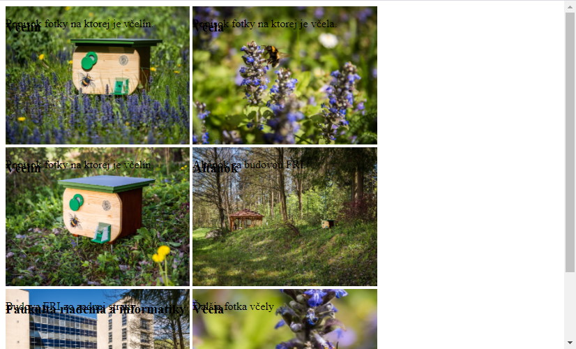
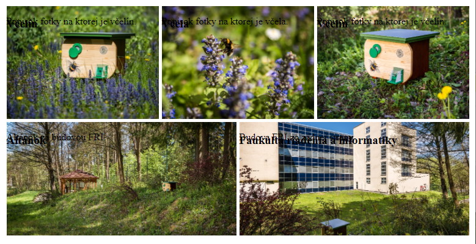
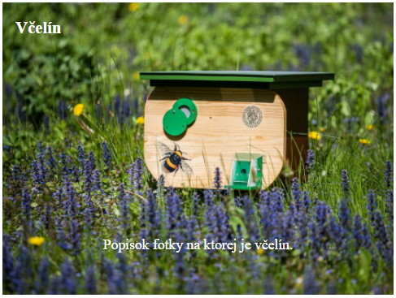

<div class="hidden">

> ## Rozcestník
> - [Späť na úvod](../../README.md)
> - Repo: [Štartér](/../../tree/main/css/gallery), [Riešenie](/../../tree/solution/css/gallery)
> - [Zobraziť zadanie](zadanie.md)
# Galéria (CSS)

</div>

## Riešenie

Pri riešení tohto príkladu budeme postupovať po jednotlivých krokoch:

1. Zobrazenie obrázkov v správnom pomere strán.
2. Zobrazenie obrázkov v mriežke.
3. Zobrazenie rôzneho počtu obrázkov na riadku podľa veľkosti obrazovky.
4. Zobrazenie popisu obrázku

### Správne zobrazenie obrázkov

Vo všeobecnosti môžeme predpokladať, že obrázky v galérii môžu mať rôzne rozmery. Niektoré môžu byť fotené na výšku, iné na šírku, byť širokouhlé až panoramatické. Ak teda chceme zobraziť obrázky rôznych rozmerov v nejakom unifikovanom rozmere, vieme to docieliť dvomi spôsobmi: buď na strane servera vygenerujeme náhľady s&nbsp;rovnakým rozmerom, alebo si ich prispôsobíme pomocou CSS. V tomto príklade si ukážeme riešenie pomocou CSS.

V CSS je problematické definovať veľkosť nejakého elementu vzhľadom na veľkosť jeho predka v percentuálnych hodnotách, ak chceme zachovať pomer strán veľkosti.

Problém tu nevytvára nastavenie CSS vlastnosti potomka na `width: 100%` (tu chceme, aby potomok vypĺňal jeho celú šírku), ale nastavenie jeho výšky. Výška zadaná v&nbsp;percentuálnej hodnote sa vyrátava z výšky predka, a to nechceme (pomer strán bude nesprávny). Čo sa dá v tejto situácii použiť, je malý trik s použitím CSS vlastnosti [`padding-top`](https://developer.mozilla.org/en-US/docs/Web/CSS/padding-top). Tá totiž, pri použití percentuálnej hodnoty, nastavuje vertikálne odsadenie, ale ako základ používa **šírku rodičovského elementu NIE svoju výšku**.

V našom prípade chceme dosiahnuť pomer `4:3`. Ak je šírka `100%`, výška bude musieť mať hodnotu `75%` aby bol dodržaný stanovený pomer. Tieto vlastnosti pridáme do CSS pravidla pre obaľovací element obrázku s atribútom `class="photo"`. Toto však samo o&nbsp;sebe nebude stačiť. Aktuálnymi CSS vlastnosťami sme len definovali veľkosť tohto prvku pomocou vnútorného odsadenia. 

Potomkovia obaľovacieho elementu budú posunutí dolu vnútorným odsadením. Tieto elementy majú zobrazovať samotný obrázok, popisok a názov obrázka. Aby sa zobrazili správne, musíme im upraviť hodnotu CSS vlastnosti `position` na `absolute`. 

To docielime pre všetkých potomkov pomocou selektora `.photo > *`. Túto vlastnosť upravíme aj predkovi na hodnotu `relative`, aby v rámci jeho vnútra bolo možné umiestňovať potomkov.

Pri hodnote `position: absolute` elementy "nezaberajú" svoje miesto a "vyplávajú" nad ostatné. Rozmer obaľovacieho elementu tak bude definovaný čisto iba vlastnosťami `width` a `padding-top`.

```css
.photo {
    position: relative;
    width: 100%;
    padding-top: 75%;
}
.photo > * {
    position: absolute;
    top: 0;
    left: 0;
}
.photo img {
    display: block;
    width: 100%;
    height: 100%;
}
```

Ďalej sme pre element `img` pridali CSS štýl, ktorý obrázok prispôsobuje a roztiahne na rozmery rodičovského elementu `photo`. Po aplikovaní tohto CSS dostaneme stránku, kde budú jednotlivé obrázky roztiahnuté na celú šírku stránky a zobrazené budú vždy bez ohľadu na veľkosť okna v pomere 4:3. Toto CSS však nezobrazuje všetky obrázky korektne:


Ako môžeme vidieť na obrázku, posledný obrázok sa nám zobrazuje zdeformovane. Pôvodný obrázok bol totižto odfotený *na výšku* a keď obrázku nastavíme rozmery na `100%`, tak sa roztiahne a zdeformuje. Túto deformáciu môžeme opraviť pridaním CSS vlastnosti [`object-fit: cover`](https://developer.mozilla.org/en-US/docs/Web/CSS/object-fit) (CSS pravidlo `.photo img`), ktorá definuje spôsob, akým sa obrázok prispôsobí pri zmene veľkosti. 

```css
.photo img {
    display: block;
    width: 100%;
    height: 100%;
    object-fit: cover;
}
```
<div style="page-break-after: always;"></div>

Po aplikovaní tejto vlastnosti na obrázok dostaneme:


### Zobrazenie obrázkov v mriežke

Momentálne sa nám obrázky zobrazujú pod sebou. Potrebovali by sme ale, aby sa zobrazili tri obrázky vedľa seba. Tu opäť existuje viacero spôsobov, ako toto dosiahnuť.

#### Riešenie cez `inline-block`

Prvým spôsobom je využitie toho, že HTML element môžeme zobraziť ako [`inline-block`](https://www.w3schools.com/css/css_inline-block.asp), čo znamená, že sa v zobrazení chová ako riadkový element, ale je mu možné pridať hodnotu pre jeho šírku a výšku.

Okrem pridania vlastnosti `display` sme zmenili aj šírku elementov. Funkcia [`calc()`](https://developer.mozilla.org/en-US/docs/Web/CSS/calc()) to spočíta presne, aj keď 1/3 zo 100 je v skutočnosti 33.333 periodických.

<div class="end">

```css
.photo {
    display: inline-block;
    position: relative;
    width: calc(100% / 3);
    padding-top: calc(75% / 3);
}
```
</div>

Ako si môžete všimnúť, aj `padding-top` bolo potrebné zmenšiť na 1/3 pôvodnej hodnoty.

Po aplikovaní tohto štýlu zostaneme prekvapení:



Namiesto troch predpokladaných obrázkov na riadok máme len dva. Navyše oproti pôvodnému prípadu máme okolo obrázkov medzery. Práve tieto medzery spôsobili, že sa nezmestia tri obrázky do jedného riadku. Pri zobrazení `inline-block` sú tieto medzery spôsobené tým, ako prehliadač zobrazuje riadkové značky. V tomto prípade hocijaký znak nachádzajúci sa medzi elementmi obrázkov bude interpretovať ako medzeru.

Ak v pôvodnom HTML kóde odstránime medzery medzi obrázkami, tak tento problém zmizne. Toto ale nie je správne riešenie, nakoľko by sme sa pri deklarácii CSS pravidiel nemali spoliehať na medzery medzi HTML elementmi.

<div class="end">

```html
<div class="photo">
    ...
</div>
<div class="photo">
    ...
</div>
```
</div>

#### Riešenie cez `float: left`

Druhým spôsobom je ponechanie CSS vlastnosti `display: inline-block` a pridáme ďalšiu CSS vlastnosť `float` nastavujúcu obtekanie. Môžeme teda uvažovať nasledujúci kód:

```css
.photo {
    float: left;
    position: relative;
    width: calc(100% / 3 - 5px);
    padding-top: calc(75% / 3);
}
```

Výsledkom bude správne zobrazenie troch obrázkov na jednom riadku:


#### Riešenie pomocou *flexbox* rozloženia

Posledným spôsobom (a odporúčaným) je riešenie pomocou *flexbox* rozloženia. Najskôr potrebujeme elementu `gallery` nastaviť, že má byť tzv. *flex kontajner* a obrázkom predpísať šírku.

```css
.gallery {
    display: flex;
    flex-wrap: wrap;
}
.photo {
    position: relative;
    width: calc(100% / 3 - 5px);
    padding-top: calc(75% / 3);
}
```

Okrem `display: flex` musíme nastaviť aj CSS vlastnosť `flex-wrap` na hodnotu `wrap`, aby sa *flexbox* nepokúšal o zobrazenie všetkých elementov na jednom riadku, ako môžeme vidieť v nasledujúcom obrázku:


Po nastavení `flex-wrap: wrap;` je už všetko v poriadku. Výhodou *flexbox* oproti riešeniu s&nbsp;obtekaním je to, že *flexbox* má veľké množstvo ďalších možností. Predstavte si, že nemáme presný počet obrázkov tak, aby sme vyplnili všetky riadky. V prípade riešenia s&nbsp;obtekaním nám posledný obrázok zostane na ľavom okraji. Ak použijeme *flexbox*, môžeme pomocou vlastnosti `justify-content` v `.gallery` nastaviť, čo sa má stať v&nbsp;prípade, že nebude dostatok obrázkov na riadku.

<div style="page-break-after: always;"></div>

Ak nastavíme `justify-content` na `center`, tak sa nám obrázky vycentrujú do stredu:


Môžeme vyskúšať aj hodnotu `space-between`, ktorá nám obrázky umiestni na okraje:


<div style="page-break-after: always;"></div>

Alebo hodnotu `space-evenly`, ktorá nám ich umiestni s rovnomernými medzerami:


Týchto vlastností je veľké množstvo a stačí si vybrať podľa potreby.

Ak nám nevyhovuje prázdne miesto v spodnom riadku, môžeme nastaviť obrázku vlastnosť `flex-grow`, vďaka ktorej sa obrázky v poslednom riadku roztiahnu tak, aby vyplnili celý priestor:

```css
.photo {
    position: relative;
    width: calc(100% / 3);
    padding-top: calc(75% / 3);
    flex-grow: 1;
}
```

<div style="page-break-after: always;"></div>

Pri tomto zobrazení ale už nebudú mať všetky obrázky pomer strán 4:3:


#### Pridanie medzier medzi obrázky

V ďalšom kroku by sme mali nastaviť medzery medzi jednotlivými obrázkami, nech nie sú nalepené na sebe.

Najjednoduchším spôsobom je pridanie vonkajšieho odsadenia pomocou CSS vlastnosti `margin`. Problém je, že okraj rozširuje element, takže ho musíme odpočítať od šírky samotného elementu. S využitím funkcie `calc()` to ale nie je žiadny problém (od celkových rozmerov odrátame celkovú veľkosť odsadenia):

```css
.photo {
    position: relative;
    width: calc(100% / 3 - 5px);
    padding-top: calc(75% / 3 - 5px);
    flex-grow: 1;
    margin: 2.5px;
}
```



### Rôzny počet obrázkov na riadku na základe veľkosti zariadenia

Pokiaľ trváme na zachovaní pomeru strán, musíme využiť tzv. [**media queries**](https://developer.mozilla.org/en-US/docs/Web/CSS/Media_Queries/Using_media_queries) anotácia `@media()`. Tie nám umožňujú aplikovať štýl na základe určitej vlastnosti. V našom prípade potrebujeme kontrolovať celkovú šírku okna prehliadača. Použijeme preto *media query* `max-width`. 

V zadaní požadujeme tri spôsoby prispôsobenia zobrazenia obrázkov. Jeden z nich bude východzí a ostatné sa budú meniť na základe aktuálnej šírky okna prehliadača. Za východzie môžeme považovať zobrazenie pre malé okno, kde sa obrázky zobrazia pod sebou. Pre ďalšie typy usporiadania potrebujeme preto definovať v `@media()` dva body zlomu, v ktorých sa bude meniť počet obrázkov na riadku. 

Prvý z nich bude platiť pre šírku okna prehliadača do `600px` a druhý do `1000px`. Veľmi závisí od poradia, v akom jednotlivé pravidlá v `@media()` zapíšeme, nakoľko posledne definované pravidlo prepisuje rovnaké CSS predchádzajúceho. Ako prvé preto musíme definovať štýlovanie pre najmenšie zobrazenie, nasledovať musí štýlovanie pre rozmer okna prehliadača `1000px` a ako posledné pre rozmer `600px`.

Podmienku platnosti daného bloku CSS štýlov definujeme pomocou pravidla `max-width`, ktoré je pravdivé, pokiaľ šírka okna nepresiahne uvedenú hodnotu.

<div style="page-break-after: always;"></div>

Nasledujúce riadky dopíšeme za definíciu pravidla `.photo`:

```css
@media (max-width: 1000px) {
    .photo {
        width: calc(100% / 2 - 5px);
        padding-top: calc(75% / 2 - 5px);
    }
}
@media (max-width: 600px) {
    .photo {
        width: calc(100% - 5px);
        padding-top: calc(75% - 5px);
    }
}
```

Prvé `@media` pravidlo prepíše prednastavenú šírku obrázku z cca `33%` na `50%` v prípade, že obrazovka má maximálnu šírku `1000px`. Druhé zas prepíše šírku obrázku na `100%` v&nbsp;prípade, že šírka zariadenia bude menšia, nanajvýš rovná `600px`.

#### Automatická zmena veľkosti pomocou *flexbox* rozloženia

V prípade, že nebudeme trvať na konštantnom pomere výšky a šírky obrázku, môžeme využiť *flexbox* automatické prispôsobovanie elementov.

Môžeme si vyskúšať nasledujúce pravidlo:

```css
.photo {
    position: relative;
    min-width: 400px;
    height: 300px;
    flex-grow: 1;
    margin: 2.5px;
}
```

V tomto príklade sme pevne určili výšku obrázka na `300px` a minimálnu šírku na `400px`. *Flexbox* následne tieto obrázky zobrazí tak, že každý z nich bude mať výšku presne `300px` a šírka bude podľa potreby tak, aby sa ich do riadku zmestilo čo najviac.

### Popis obrázku

V aktuálnej verzii ešte nemáme naštýlovaný popis obrázku. Ten sa momentálne prelína s&nbsp;obrázkom.


Začneme zo správnym umiestnením textov a nastavením správnej farby. Farbu nastavíme celému elementu `photo`.

```css
.photo {
    color: white;
}
```

Doplnenie pre správne umiestnenie ďalších prvkov:

```css
.photo h3 {
    top: 0;
    left: 15px;
}
.photo p {
    top: auto;
    bottom: 30px;
    width: 100%;
    text-align: center;
}
```

Pri nastavovaní popisu obrázkov sme museli prepísať CSS vlastnosť `top`, pretože sme ju nastavili všetkým elementom v obrázku pomocou selektora `.photo > *`.



Ďalším krokom bude stmavenie celého obrázku. Najjednoduchšie bude použitie CSS vlastnosti `opacity`, ktorá umožní nastaviť priehľadnosť ľubovoľnému elementu. Ak to skombinujeme s tmavou farbou pozadia obrázku, dostaneme efekt stmaveného pozadia.

```css
.photo {
    background-color: black;
}
.photo:hover img {
    opacity: 0.4;
}
```

CSS vlastnosť `opacity` sme nastavili pomocou selektora `:hover`, takže pozadie stmavne až po prechode kurzora myši ponad obrázok.


Pokiaľ chceme, aby sa aj texty zobrazili až po premiestnení kurzora myši na obrázok, tak musíme upraviť ich CSS nasledujúco:

```css
.photo p, .photo h3 {
    display: none;
}
.photo:hover p, .photo:hover h3 {
    display: block;
}
```

Pomocou prvého pravidla skryjeme oba elementy a pomocou druhého ich zobrazíme (keď umiestnime kurzor myši nad element `photo`).

### Animácie pri prechode kurzora myši ponad obrázok

Aktuálne riešenie funguje, výsledný dojem ale nie je najlepší. Skúsime teda pridať zopár animácií na zlepšenie používateľského zážitku. Začneme dynamickým stmavovaním obrázku. Najjednoduchší spôsob bude využitie CSS vlastnosť `transition`. Výhoda `transition` oproti vlastnej CSS animácii je v jednoduchšom zápise. Pri `transition` definujeme len vlastnosť, ktorej sa to týka a dobu zmeny.

<div style="page-break-after: always;"></div>

Túto vlastnosť použijeme pre element `img`:

```css
.photo img {
    transition: opacity 0.5s;
}
```

Táto definícia zabezpečí, že zmena nebude okamžitá (bude trvať 0.5 sekundy), vždy keď sa bude meniť CSS vlastnosť `opacity` (napríklad po prechode myšou).

Druhú animáciu, ktorú pridáme, je "príchod" popisu zdola. Tento "príchod" budeme animovať pomocou transformácie y-pozície. Najskôr si pripravíme `keyframes` animácie:

```css
@keyframes description-in {
    from {
        transform: translateY(1000%);
    }
    to {
        transform: translateY(0);
    }
}
```

Táto animácia na začiatku umiestni element o `1000%` nižšie (táto hodnota je veľká, aby bol element na začiatku animácie skutočne mimo obrázku). Ak by sme dali len `100%`, tak by animácia začala už z obrázku.

Na aplikovanie animácie následne stačí použiť:

```css
.photo:hover p {
    animation-delay: 0.5s;
    animation: description-in 3s;
}
```

Celková animácia "príchodu" bude trvať 1 sekundu s tým, že sme jej začiatok posunuli o&nbsp;pol sekundy, aby sme dosiahli krajší efekt príchodu popisu.

Posledným problémom, ktorý musíme vyriešiť je, že len čo sme posunuli popis o `1000%` v&nbsp;smere osi Y, tak počas animácie sa nám môže stať, že sa na stránke objaví posuvník.


Na obrázku vyššie vidno, ako sa v pravom dolnom rohu obrázku postupne nasúva text a zároveň vidíme zobrazený posuvník napravo. Po skončení animácie posuvník zmizne.

Ak nastavíme pozadie stránky na tmavú farbu, môžeme presne vidieť, čo sa deje:


Text sa zobrazuje v skutočnosti mimo elementu obrázku. Toto vyriešime tak, že hlavnému elementu obrázku nastavíme hodnotu CSS parametra `overflow` na `hidden`. To spôsobí, že ak obsah elementu presahuje jeho veľkosť, tak sa posuvníky nezobrazia.

```css
.photo {
    overflow: hidden;
}
```

Výsledná galéria bude vyzerať takto:


