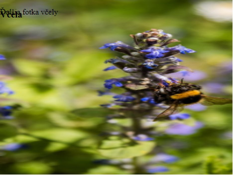
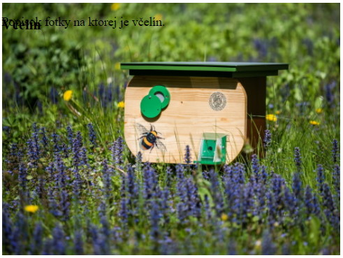
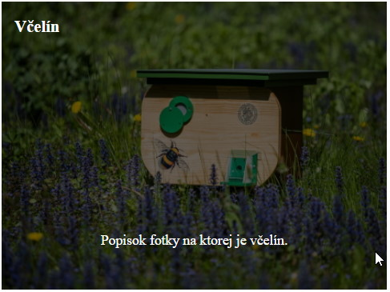
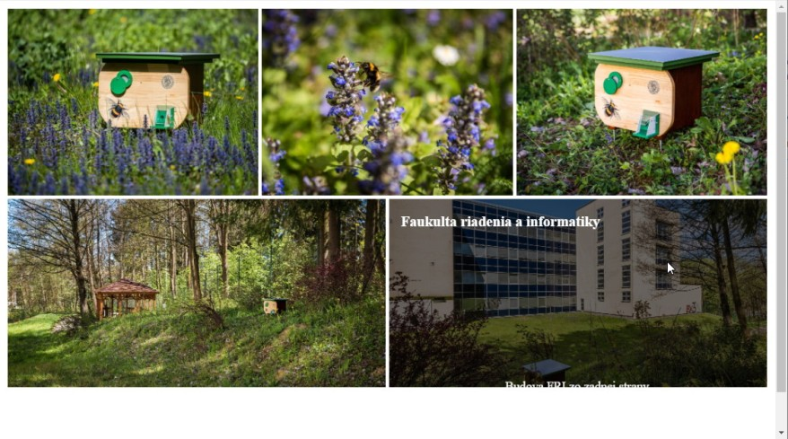

<div class="hidden">

> ## Rozcestník
> - [Späť na úvod](../../README.md)
> - Repo: [Štartér](/../../tree/main/css/gallery), [Riešenie](/../../tree/solution/css/gallery).
> - [Zobraziť zadanie](zadanie.md)

# Galéria (CSS)

</div>

## Riešenie

Pri riešení tohto príkladu budeme postupovať po jednotlivých krokoch:

1. Zobrazenie obrázkov v správnom pomere strán.
2. Zobrazenie obrázkov v mriežke.
3. Zobrazenie rôzneho počtu obrázkov na riadku podľa veľkosti obrazovky.
4. Zobrazenie popisu obrázku

### Správne zobrazenie obrázkov

Vo všeobecnosti môžeme predpokladať, že obrázky v galérii môžu mať rôzne rozmery. Niektoré môžu byť fotené na výšku, iné na šírku, byť širokouhlé až panoramatické. Ak teda chceme zobraziť obrázky rôznych rozmerov v nejakom unifikovanom rozmere vieme to docieliť dvomi spôsobmi: buď na strane servera vygenerujeme náhľady s rovnakým rozmerom alebo si ich prispôsobíme pomocou CSS. V tomto príklade si ukážeme riešenie čisto pomocou CSS.


https://developer.mozilla.org/en-US/docs/Web/CSS/padding-top
https://css-tricks.com/oh-hey-padding-percentage-is-based-on-the-parent-elements-width/

V CSS je celkom problematické zadefinovať veľkosť nejakého elementu vzhľadom na veľkosť jeho predka a to tak, že keď sa zmení veľkosť predka, zmení sa aj veľkosť potomka pričom ostáva zachovaný pomer strán jeho veľkosti.

Problém tu nevytvára nastavenie CSS vlastnosti potomka na `width: 100%` (tu chceme aby potomok vypĺňal jeho celú šírku) ale nastavenie jeho šírky. Šírka zadaná v percentuálnej hodnote sa vyrátava zo šírky predka a to nechceme (pomer strán bude nesprávny). Čo sa dá v tejto situácií použiť je malý trik s použitím CSS vlastnosti [`padding-top`](https://developer.mozilla.org/en-US/docs/Web/CSS/padding-top). Tá totiž, pri použití percentuálnej hodnoty, nastavuje vertikálne odsadenie ale ako základ používa __šírku rodičovského elementu NIE svoju výšku__.

Ak chceme dosiahnuť pomer `4:3` a šírka je hodnota `100%`, výška bude musieť mať hodnotu `75%`. Tieto vlastnosti pridáme do CSS pravidla pre obaľovací element s atribútom `class="photo"`. Toto však samo o sebe nebude stačiť. Aktuálnymi CSS vlastnosťami sme len zadefinovali veľkosť tohto prvku pomocou vnútorného odsadenia. 

Potomkovia obaľovacieho elementu budú posunutý dolu vnútorným odsadením. Tieto elementy majú zobrazovať samotný obrázok, popisok a názov obrázka. Aby sa zobrazili správne, musíme im upraviť hodnotu CSS vlastnosti `position` na `absolute`. To docielime pre všetkých potomkom pomocou selektoru `.photo > *`. Túto vlastnosť upravíme aj predkovi na hodnotu `relative`, aby v rámci jeho vnútra bolo možné umiestňovať potomkov.

```css
.photo {
    position: relative;
    width: 100%;
    padding-top: 75%;
}
.photo > * {
    position: absolute;
    top: 0;
    left: 0;
}
.photo img {
    display: block;
    width: 100%;
    height: 100%;
}
```

Ďalej sme pre element `img` pridali CSS štýl, ktorý prispôsobuje a roztiahne na rozmery rodičovského elementu `photo`. 
Po aplikovaní tohto CSS dostaneme stránku, kde budú jednotlivé fotky roztiahnuté na celú šírku stránky a zobrazené budu vždy bez ohľadu na veľkosť okna v pomere 4:3.  Toto CSS však nezobrazuje všetky obrázky korektne:



Ako môžeme vidieť na obrázku, posledná fotka sa nám zobrazuje zdeformovane. Pôvodný obrázok bol totižto odfotený *na výšku* a keď obrázku nastavíme rozmery na `100%`, tak sa roztiahne a zdeformuje. Túto deformáciu môžeme opraviť pridanúm CSS vlastnosti [`object-fit: cover`](https://developer.mozilla.org/en-US/docs/Web/CSS/object-fit) (CSS pravidlo `.photo img`), ktorá definuje spôsob, akým sa obrázok prispôsobí pri zmene veľkosti. 

```css
.photo img {
    display: block;
    width: 100%;
    height: 100%;
    object-fit: cover;
}
```

Po aplikovaní tejto vlastnosti na obrázok dostaneme:


### Zobrazenie obrázkov v mriežke

Momentálne sa nám obrázky zobrazujú pod sebou. Potrebovali by sme ale, aby sa zobrazili tri obrázky vedľa seba. Tu opäť existuje viacero spôsobov ako toho dosiahnuť.

#### Riešenie cez `inline-block`

Prvým spôsobom je využitie toho, že HTML element môžeme zobraziť ako [`inline-block`](https://www.w3schools.com/css/css_inline-block.asp), čo znamená, že sa v zobrazení chová ako riadkový element ale je mu možné pridať hodnotu pre jeho šírku a výšku.

Okrem pridania CSS vlastnosti `display` sme zmenili aj šírku elementov. Využili sme tu funkciu [`calc()`](https://developer.mozilla.org/en-US/docs/Web/CSS/calc()), pretože 1/3 zo 100 je v skutočnosti 33.3333 periodických a `calc()` to spočíta presne.

```css
.photo {
    display: inline-block;
    position: relative;
    width: calc(100% / 3);
    padding-top: calc(75% / 3);
}
```

> Ako si môžete všimnúť, aj `padding-top` bolo potrebné zmenšiť na 1/3 pôvodnej hodnoty.

Po aplikovaní tohto štýlu zostaneme prekvapení:


Namiesto troch predpokladaných obrázkov na riadok máme len dva. Navyše oproti pôvodnému prípadu máme okolo obrázkov medzery. Práve tieto medzery spôsobili, že sa nezmestia tri obrázky do jedného riadku. Pri zobrazení `inline-block` sú tieto medzery spôsobené tým ako prehliadač zobrazuje riadkové značky. V tomto prípade hocijaký znak nachádzajúci sa medzi elementami fotiek bude interpretovať ako medzeru.

Ak v pôvodnom HTML kóde odstránime medzery medzi fotkami, tak tento problém zmizne. Toto ale nie je správne riešenie, nakoľko by sme sa pri deklarácii CSS pravidiel nemali spoliehať na medzery medzi HTML elementmi.

```html
<div class="photo">
    ...
</div>
<div class="photo">
    ...
</div>
```

#### Riešenie cez `float: left`

Druhým spôsobom je ponechanie CSS vlastnosti `display: inline-block` a pridáme ďalšiu CSS vlastnosť `float` nastávajúcu obtekanie. Môžeme teda uvažovať nasledovný kód:

```css
.photo {
    float: left;
    position: relative;
    width: calc(100% / 3 - 5px);
    padding-top: calc(75% / 3);
}
```

Výsledkom bude správne zobrazenie troch fotiek na jednom riadku:


#### Riešenie cez flexbox

Posledným spôsobom (a odporúčaným) je riešenie pomocou rozloženia **flexbox**. Najskôr potrebujeme elementu `gallery` nastaviť, že má byť tzv. *flex kontajner* a fotkám predpísať šírku.

```css
.gallery {
    display: flex;
    flex-wrap: wrap;
}
.photo {
    position: relative;
    width: calc(100% / 3 - 5px);
    padding-top: calc(75% / 3);
}
```

Okrem `display: flex` musíme nastaviť aj CSS vlastnosť `flex-wrap` na hodnotu `wrap`, aby sa *flexbox* nepokúšal o zobrazenie všetkých elementov na jednom riadku, ako môžeme vidieť v nasledovnom obrázku:


Po nastavení `flex-wrap: wrap;` je už všetko v poriadku. Výhodou *flexboxu* oproti riešeniu s obtekaním je to, že *flexbox* má veľké množstvo ďalších možností. Predstavte si, že nemáme presný počet obrázkov tak, aby sme vyplnili všetky riadky. V prípade riešenia s obtekaním nám posledný obrázok zostane na ľavom okraji. Ak použijeme *flexbox*, môžeme pomocou vlastnosti `justify-content` v `.gallery` nastaviť, čo sa má stať v prípade, že nebude dostatok fotiek na riadku.

Ak nastavíme `justify-content` na `center`, tak sa nám fotky vycentrujú do stredu:


Môžeme vyskúšať aj hodnotu `space-between`, ktorá nám fotky umiestni na okraje:


Alebo hodnotu `space-evenly`, ktorá nám ich umiestni s rovnomernými medzerami:


Týchto vlastností je veľké množstvo a stačí si vybrať podľa potreby.

Ak nám nevyhovuje prázdne miesto v spodnom riadku, môžeme nastaviť fotke vlastnosť `flex-grow`, vďaka ktorej sa obrázky v poslednom riadku roztiahnú tak, aby vyplnili celý priestor:

```css
.photo {
    position: relative;
    width: calc(100% / 3);
    padding-top: calc(75% / 3);
    flex-grow: 1;
}
```

Pri tomto zobrazení ale už nebudú mať všetky fotky pomer strán 4:3.


#### Pridanie medzier medzi obrázky

V ďalšom kroku by sme mali nastaviť medzery medzi jednotlivými fotkami, nech nie sú nalepené na sebe.

Najjednoduchším spôsobom je pridanie vonkajšieho odsadenia pomocou CSS vlastnosti `margin`. Problém je, že okraj rozširuje element, takže ho musíme odpočítať od šírky samotného elementu. S využitím funkcie `calc()` to ale CSS žiaden problém (od celkových rozmerov odrátame celkovú veľkosť odsadenia):

```css
.photo {
    position: relative;
    width: calc(100% / 3 - 5px);
    padding-top: calc(75% / 3 - 5px);
    flex-grow: 1;
    margin: 2.5px;
}
```


### Rôzne počet obrázkov na riadku na základe veľkosti zariadenia

Pokiaľ trváme na zachovaní pomeru strán musíme využiť tzv. [**media queries**](https://developer.mozilla.org/en-US/docs/Web/CSS/Media_Queries/Using_media_queries) anotácia `@media()` Tie nám umožňujú aplikovať štýl na základe určitej vlastnosti. V našom prípade potrebujeme kontrolovať celkovú šírku viewportu. Použijeme preto media query `max-width`. 

V zadaní požadujeme tri spôsoby prispôsobenia zobrazenia fotiek. Jeden z nich bude východzie a ostatné sa budu meniť na základe aktuálnej šírky viewportu. Za východzie môžeme považovať zobrazenie pre malé okno kde sa fotieky zobrazia pod sebou. Pre ďalšie uporiadania potrebujeme preto definovať v `@media()` dva body zlomu v ktorých sa bude meniť počet obrázkov na riadku. 

Prvý z nich bude platiť pre šírku viewportu do `600px` a druhý do `1000px`. Veľmi závisí na poradí v akom jednotlivé pravidlá v `@media()` zapíšeme, nakoľko posledne zadefinované pravidlo prepisuje rovnaké predchádzajúce.  Ako prvé preto musíme zadefinovať štýlovanie pre najmenšie zobrazenie, nasledovať musí štýlovanie pre rozmer viewpoeru `1000px` a ako posledné pre rozmer viewportu `600px`.

Nasledujúce riadky dopíšeme za definíciu pravidla `.photo`:

```css
@media (max-width: 1000px) {
    .photo {
        width: calc(100% / 2 - 5px);
        padding-top: calc(75% / 2 - 5px);
    }
}
@media (max-width: 600px) {
    .photo {
        width: calc(100% - 5px);
        padding-top: calc(75% - 5px);
    }
}
```

Prvé pravidlo prepíše prednastavenú šírku fotky z cca `33%` na `50%` v prípade, že obrazovka má maximálnu širku `1000px`. Druhé zas prepíše šírku fotky na `100%` v prípade, že šírka zariadenia bude menšia, nanajvýš rovná `600px`.

#### Automatická zmena veľkosti pomocou *flexboxu*.

V prípade, že nebudeme trvať na konštantnom pomere výšky a šírky obrázku, môžeme využiť flexboxové automatické prispôsobovanie elementov.

Môžeme si vyskúšať nasledovné pravidlo:

```css
.photo {
    position: relative;
    min-width: 400px;
    height: 300px;
    flex-grow: 1;
    margin: 2.5px;
}
```

V tomto príklade sme pevne určili výšku obrázka na `300px` a minimálnu šírku na `400px`. *Flexbox* následne tieto obrázky zobrazí tak, že každý z nich bude mať výšku presne `300px` a šírka bude podľa potreby tak, aby sa ich do riadku zmestilo čo najviac.

### Popis obrázku

V aktuálnej verzii ešte nemáme naštýlovaný popis obrázku. Ten sa momentálne prelína s obrázkom.



Začneme zo správnym umiestnením textov a nastavením správnej farby. Farbu nastavíme celému elementu `photo`.

```css
.photo {
    color: white;
}
```

Doplnenie pre správne umiestnime ďalších prvkov :

```css
.photo h3 {
    top: 0;
    left: 15px;
}
.photo p {
    top: auto;
    bottom: 30px;
    width: 100%;
    text-align: center;
}
```

Pri nastavovaní popisu fotiek sme museli prepísať CSS vlastnosť `top`, pretože sme ju nastavili všetkým elementom vo fotke pomocou selektoru `.photo > *`.


Ďalším krokom bude stmavenie celého obrázku. Najjednoduchšie bude použitie CSS vlastnosti `opacity`, ktorá umožní spriehľadniť ľubovolný element. Ak to skombinujeme s tmavou farbou pozadia fotky dostaneme efekt stmaveného pozadia.

```css
.photo {
    background-color: black;
}
.photo:hover img {
    opacity: 0.4;
}
```

CSS vlastnosť `opacity` sme nastavili pomocou selektoru `:hover`, takže pozadie stmavne až po prejdení kurzora myši ponad obrázok.



Pokiaľ chceme, aby sa aj texty zobrazili až po premiestnení kurzora myši na fotku, tak musíme upraviť ich CSS nasledovne:

```css
.photo p, .photo h3 {
    display: none;
}
.photo:hover p, .photo:hover h3 {
    display: block;
}
```

Pomocou prvého pravidla skryjeme oba elementy a pomocou druhého ich zobrazíme (keď umiestníme kurzor myši nad element photo).

### Animácie pri prechode kurzora myši ponad obrázok

Aktuálne riešenie funguje, výsledný dojem ale nie je najlepší. Skúsime teda pridať zopár animácií pre spríjemnenie používateľského zážitku. Začneme tým dynamickým stmavovaním fotky. Najjednoduchší spôsob bude využitie CSS vlastnosti `transition`. Výhoda `transition` oproti vlastnej CSS animácii je v jednoduchšom zápise. Pri `transition` definujeme len vlastnosť, ktorej sa to týka a dobu zmeny.

Túto vlastnosť definujeme pre element `img` fotky:

```css
.photo img {
    transition: opacity 0.5s;
}
```

Táto definícia zabezpečí, že zmena nebude okamžitá (bude trvať 0.5 sekundy), vždy keď sa bude meniť CSS vlastnosť `opacity` (napríklad po prechode myšou).

Druhú animáciu, ktorú pridáme je "príchod" popisu zdola. Tento "príchod" budeme animovať pomocou transformácie y-pozície. Najskôr si pripravíme `keyframes` animácie:

```css
@keyframes description-in {
    from {
        transform: translateY(1000%);
    }
    to {
        transform: translateY(0);
    }
}
```

Táto animácia na začiatku umiestni element o `1000%` nižšie (táto hodnota je veľká aby bol element na začiatku animácie skutočne mimo obrázku). Ak by sme dali len `100%`, tak by animácia začala už z obrázku.

Pre aplikovanie animácie následne stačí použiť:

```css
.photo:hover p {
    animation-delay: 0.5s;
    animation: description-in 3s;
}
```

Celková animácia "príchodu" bude trvať 1 sekundu s tým, že sme jej začiatok posunuli o pol sekundy, aby sme dosiahli krajší efekt príchodu popisu.

Posledným problémom, ktorý musíme vyriešiť je, že akonáhle sme posunuli popis o `1000%` v smere osi Y, tak počas animácie sa nám môže stať, že sa na stránke objaví posuvník.



Na obrázku vyššie môžeme vidieť, ako sa v pravom dolnom obrázku postupne nasúva text a počas tejto animácie vidíme zobrazený posuvník napravo. Po skončení animácie posuvník zmizne.

Ak nastavíme pozadie stránky na tmavú farbu, môžeme presne vidieť, čo sa deje:


Text sa zobrazuje v skutočnosti mimo elementu fotky. Tento problém môžeme vyriešiť tak, že hlavnému elementu fotky nastavíme hodnotu CSS parametra `overflow` na `hidden`. To spôsobí, že ak element obsahuje zobsah presahujúci jeho zobrazene a mali by sa zobraziť posuvníky tak sa nezobrazia.

```css
.photo {
    overflow: hidden;
}
```

Výsledná galéria bude vyzerať nasledovne:


