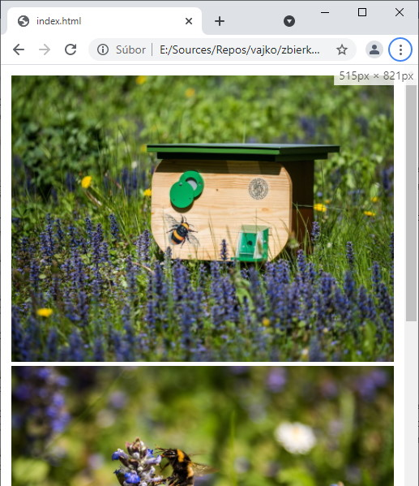
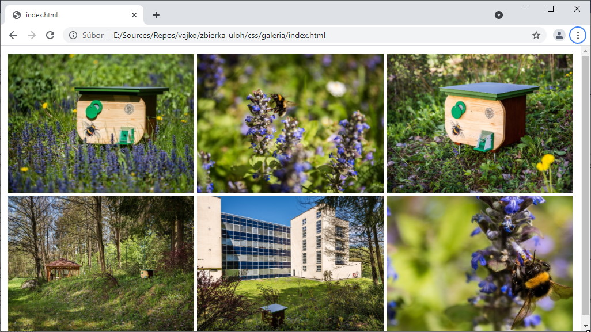
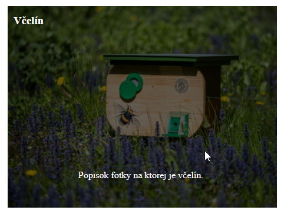

<div class="hidden">

> ## Rozcestník
> - [Späť na úvod](../../README.md)
> - Repo: [Štartér](/../../tree/main/css/gallery), [Riešenie](/../../tree/solution/css/gallery).
</div>

# Galéria
<div class="info"> 

**Hlavný jazyk príkladu**: CSS

**Ostatné použité jazyky**: HTML

**Obťažnosť**: 4/5

**Obsah príkladu**: Základná demonštrácia CSS *flexbox* rozloženia, pokročilejšie spôsoby zobrazovania obrázkov, *media queries* a animácie.
</div>

## Zadanie

Máme definované HTML, ktoré vyzerá nasledovne:

```html
<div class="gallery">
    <div class="photo">
        
        <h3>Včelín</h3>
        <p>Popisok fotky, na ktorej je včelín.</p>
    </div>

    <div class="photo">
        
        <h3>Včela</h3>
        <p>Popisok fotky, na ktorej je včela.</p>
    </div>
    ...
</div>
```

Naštýlujte pomocou CSS túto galériu nasledovne:

1. Obrázky budú zobrazené v mriežke.
2. Mriežka sa bude prispôsobovať veľkosti obrazovky - na veľkom displeji (šírka viac ako 1000px) zobrazte 3 obrázky
   vedľa seba. Pri strednom (šírka > 600px) zobrazte 2 a na malých displejoch zobrazte len jeden.
3. Obrázky vždy vyplnia celú dostupnú šírku.
4. Obrázky budú mať rozmer strán v pomere 4:3.
5. Názov a popisok obrázku sa zobrazí tak, že po "príchode" myši na obrázok obrázok postupne stmavne, nadpis sa 
   zobrazí v ľavom hornom rohu a popisok sa postupne nasunie zo spodu obrázku.

#### Zobrazenie galérií na rôznych veľkostiach zariadení

Zariadenie s malým displejom:



Zariadenie so stredne veľkým displejom:


Zariadenie s veľkým displejom:



Informácie o obrázku:



<div class="hidden">

[Zobraziť riešenie](riesenie.md)
</div>