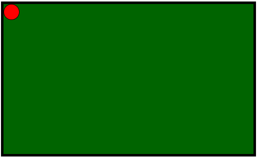

<div class="hidden">

> ## Rozcestník
> - [Späť na úvod](../../README.md)
> - Repo: [Štartér](/../../tree/main/css/pool), [Riešenie](/../../tree/solution/css/pool).

# Gulečník (CSS)

</div>

## Riešenie

Začneme definíciou HTML kódu pre túto úlohu. Potrebujeme zobraziť stôl a guličku na ňom.

```html

<div class="table">
    <div class="ball"></div>
</div>
```

Následne je potrebné tieto elementy naštýlovať. Pre stôl nastavíme veľkosť `500px` x `300px`, tmavozelené pozadie a čierny rámček. Loptička bude mať priemer `30px`, červenú farbu a bude okrúhla. Na zobrazenie HTML elementu ako kruh môžeme využiť CSS vlastnosť `border-radius`.

```css
.table {
    position: relative;
    width: 500px;
    height: 300px;
    background: darkgreen;
    border: 5px solid black;
}

.ball {
    position: absolute;
    width: 30px;
    height: 30px;
    background: red;
    border: 1px solid black;
    border-radius: 50%;
}
```

Okrem farby sme elementom nastavili aj pozície. Gulička má nastavenú pozíciu na `absolute`, aby sme ju pomocou vlastností `top` a `left` mohli umiestnisť na ľubovolné miesto v rámci stola. Stolu sme museli nastaviť pozíciu na `relative`, aby sme mohli lotičku umiestňovať absolútne vzhľadom na stôl.

Výsledok bude vyzerať nasledovne.



Pre pohyb loptičky v zvislom smere pripravíme animáciu:

```css
@keyframes y-axis {
    from {
        top: 0px;
    }
    to {
        top: 270px;
    }
}
```

Táto animácia bude presúvať loptičku zhora dole. Animáciu na loptičku aplikujeme nasledovne:

```css
.ball {
    animation: y-axis 3.3s linear alternate infinite;
}
```

Jednotlivé hodnoty v tomto zápise majú nasledovný význam:

- `y-axis` - názov animácie, ktorú sme si zadeklarovali pomocou kľúčového slovíčka `@keyframes`.
- `3.3s` - čas trvania animácie. Počas tohto času bude loptička plynule meniť svoju pozíciu na osi `Y`.
- `linear` - takzvaná *timing* funkcia. Táto funkcia popisuje spôsob, akým sa v čase bude meniť hodnota. Funkcia `linear` bude meniť hodnotu lineárne. Pre zaujímavejšie animácie sa dajú použiť definície *timing* funkcie pomocou kubickej beziérovej krivky. Tákuto funkciu si môžete vygenerovať napríklad na stránke [cubic-bezier.com](https://cubic-bezier.com).
- `alternate` - definuje smer animácie (`animation-direction`). Tento smer môže byť od začiatku po koniec, od konca po začiatok, alebo v našom prípade `alternate` bude animáciu prehrávať tam a späť.
- `infinite` - definuje počet opakovaní animácie. V našom prípade chceme, aby sa loptička odrážala až, kým neopustíme stránku.

Po aplikovaní animácie by sme mali vidieť, ako sa loptička najskôr hýbe dole, a potom sa odrazí a pôjde hore. Toto by sa malo opakovať donekonečna.

Aby sme ale dosiahli pohyb loptičky aj v osi `X`, musíme pridať ďalšiu animáciu. Táto bude vyzerať veľmi podobne ako animácia pohybu v smere osi `Y`:

```css
@keyframes x-axis {
    from {
        left: 0px;
    }
    to {
        left: 470px;
    }
}
```

Pokiaľ chceme jednému elementu pridať viacero animácií, tak ich oddeľujeme čiarkou:

```css 
.ball {
    ... 
    animation: x-axis 2s linear alternate infinite, y-axis 3.3s linear alternate infinite;
}
```

Aj druhá animácia používa rovnaké parametre. Jediným rozdielom je čas. Animácia na vodorovnej osi trvá 2s a animácia na zvislej osi trvá 3.3s. Pokiaľ budeme tieto časy meniť, zmení sa nám uhol, pod ktorým sa bude loptička pohybovať.

<div class="solution">

Kompletné zdrojové kódy hotového riešenia môžete nájsť na tejto URL adrese:

[https://github.com/thevajko/zbierka-uloh/tree/solution/css/pool](https://github.com/thevajko/zbierka-uloh/tree/solution/css/pool)


</div>
