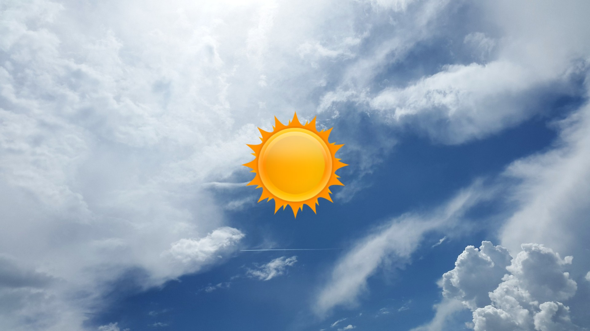

<div class="hidden">

> ## Rozcestník
> - [Späť na úvod](../../README.md)
> - Repo: [Štartér](/../../tree/main/css/position), [Riešenie](/../../tree/solution/css/position).
> - [Zobraziť zadanie](zadanie.md)
# Pozícia elementov

</div>

## Riešenie

Na riešenie úlohy budeme potrebovať HTML a CSS súbor. V HTML súbore budú základné elementy, ktoré budeme potrebovať pre riešenie úlohy a CSS súbor bude obsahovať všetky CSS pravidlá.  Obrázky umiestnime do adresára `img`.

### HTML dokument

Vytvoríme si základnú kostru HTML súboru. Súbor bude obsahovať odkaz na externý CSS súbor, pričom využijeme relatívnu cestu k adresáru, čím dosiahneme ľahkú prenositeľnosť celého riešenia (v prípade zmeny adresára celého projektu). Sekcia `<head>` bude vyzerať:

```html
<head>
    <meta charset="utf-8">
    <title>Obloha</title>
    <link rel="stylesheet" href="styl.css">
</head>
```

Telo HTML dokumentu bude tvorené kontajnermi pre jednotlivé elementy. Podľa zadania máme nakresliť jedno slnko a štyri vtáčiky. Preto vytvoríme spolu päť kontajnerov a každému z nich pridáme príslušnú CSS triedu pomocou atribútu `class`. Pozadie prepojíme priamo so značkou `<body>` bez CSS triedy.

```html
<body>
    <div class="sun"></div>
    <div class="bird"></div>
    <div class="bird"></div>
    <div class="bird"></div>
    <div class="bird"></div>
</body>
```

### CSS štýl

#### Pozadie scenérie

CSS súbor bude obsahovať všetky pravidlá. Najskôr si pripravíme pozadie. Na definovanie pozadia využijeme selektor značky `body`. Pozadie bude tvorené obrázkom definovaným CSS vlastnosťou `background-image` a nebude sa opakovať. Opakovanie by bolo vhodné použiť, ak máme obrázok menší, ako je kontajner, v ktorom bude umiestnený a takto nastavíme, či sa bude v osi X a Y sa bude opakovať (dlaždicový efekt).

Obrázok roztiahneme na celú plochu tela HTML dokumentu pomocou CSS vlastnosti `background-size`. Nastavenie `cover` zabezpečí, že sa obrázok roztiahne na celú plochu kontajnera (v tomto prípade okna prehliadača), aj keby sa mal obrázok deformovať roztiahnutím, alebo orezať. 

Presnejšie by bolo v zmysle pojmu okno prehliadača použiť pojem *viewport*, ktorý je síce v mnohých situáciach rovnaký ako viditeľná klientska plocha okna prehliadača, ale bez potenciálnych posuvníkov a takisto bez ostatných častí, ako sú nástrojové lišty prehliadača a podobne. V našom príklade, ak zameníme pojem *viewport* za okno prehliadača, dopustíme sa istej nepresnosti, ale pre riešenie príkladu (a rovnako aj ďalších v tejto knihe) to nebude mať zásadný vplyv.

Element `body` má štandardne v prehliadači nastavené vonkajšie odsadenie na `8px` z každej strany, a aby sme tento okraj zrušili a obrázok mali roztiahnutý na celé okno, nastavíme túto hodnotu na `0`. Na záver musíme ešte nastaviť výšku na `100%`, inak sa pozadie neroztiahne na celú vertikálnu výšku okna prehliadača. Výsledné pravidlo bude vyzerať takto:

```css
body {
    background-image: url("img/sky.jpg");
    background-repeat: no-repeat;
    background-size: cover;
    margin: 0;
    height: 100%;
}
```

#### Slnko

Druhým krokom bude umiestnenie slnka doprostred okna prehliadača. Pomocou selektora triedy definujeme najprv obrázok pozadia vlastnosťou `background-image`. Takisto nastavíme veľkosť obrázku pomocou CSS vlastností `width` a `height` na `256px`, čo je skutočná veľkosť obrázku. Toto nastavenie je dôležité, aby nám správne fungovalo napr. posunutie obrázku presne do presného stredu (vlastnosť `transform`).

Dôležitým nastavením je hodnota `absolute` CSS vlastnosti `position`. Týmto nastavením získame možnosť nastavovať pozíciu prvku kdekoľvek v okne prehliadača pomocou CSS vlastností `top` a `left`. Tieto CSS vlastnosti určujú vzdialenosť od vrchu a ľavej strany okraja, v našom prípade, elementu `body`. Obrázok chceme mať vždy uprostred, preto zvolíme hodnotu `50%`, a tak bude pri každej zmene veľkosti okna slnko v strede.

Ak však máme byť úplne presní, v strede bude pravý horný roh obrázku. Ak by sme chceli, aby v strede okna bol stred obrázku slnka, potrebujeme obrázok posunúť o polovicu jeho veľkosti vľavo a hore. Pomôžeme si CSS vlastnosťou `transform` a obrázok pomocou CSS funkcie `translate()` posunieme o `50%` jeho výšky, resp. šírky. Pravidlo bude vyzerať takto:

```css
.sun {
    background-image: url("img/sun.png");
    background-size: contain;
    width: 256px;
    height: 256px;
    position: absolute;
    top: 50%;
    left: 50%;
    transform: translate(-50%, -50%);
}
```
<div style="page-break-after: always;"></div>
Po aplikovaní tohto pravidla bude čiastkové riešenie vyzerať nasledovne:



#### Vtáčiky

Teraz do riešenia doplníme obrázky vtáčikov. Pri definovaní štýlu vtáčika využijeme všetky postupy, ako sme použili pri obrázku slnka. Nastavenie `background-size: contain ` využijeme na to, aby sa obrázok zobrazil celý aj po zmenšení (originálna veľkosť obrázku je `298px` x `252px`) a pri zobrazení sa neorezal.Keďže obrázok budeme potrebovať na viacerých miestach, nebudeme v tomto pravidle robiť žiadne umiestňovanie, ale necháme to na iné pravidlá. Jediné, čo nastavíme, bude, že element bude používať absolútnu pozíciu:

```css
.bird {
    background-image: url("img/bird.png");
    background-size: contain;
    position: absolute;
    width: 150px;
    height: 150px;
}
```

Ako sme spomínali, budeme potrebovať štyri elementy s obrázkom vtáčika. Mohli by sme teda vytvoriť štyri samostatné elementy a každý by mal rovnaké CSS vlastnosti. To by však nebol veľmi efektívny spôsob a veľa vlastností by sa zbytočne opakovalo. Lepšie bude využiť možnosť definovania viacerých tried pri jednom HTML elemente a tým vlastnosti skombinovať. Pripravíme si teda štyri CSS pravidlá, pričom každé bude definovať iné nastavenie pozície prvku:

```css
.top {
    top: 0;
}
.bottom {
    bottom: 0;
}
.left {
    left: 0;
}
.right {
    right: 0;
}
```

Tieto pravidlá potom skombinujeme v HTML atribúte `class`:

```html
<div class="bird top left"></div>
<div class="bird top right"></div>
<div class="bird bottom left"></div>
<div class="bird bottom right"></div>
```

Takto dosiahneme, že pravidlá sa nebudú zbytočne opakovať a celé riešenie bude prehľadné. Podobným spôsobom vytvoríme aj efekt otočenia obrázku vtáčika a aplikujeme ho len na tie obrázky, ktoré potrebujeme otočiť. Využijeme na to opäť CSS vlastnosť `transform`, ktorá pomocou CSS funkcie `scaleX()` dokáže otočiť obrázok v požadovanej osi:

```css
.flip {
    transform: scaleX(-1);
}
```

A opäť triedu pripojíme len k elementom, ktoré potrebujeme otočiť. Výsledný HTML kód potom bude:

```html
<div class="bird top flip left"></div>
<div class="bird top right"></div>
<div class="bird bottom flip left"></div>
<div class="bird bottom right"></div>
```
