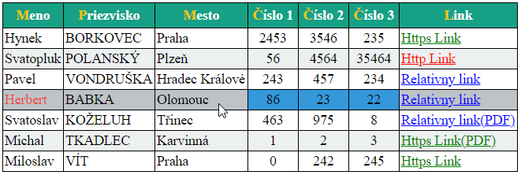
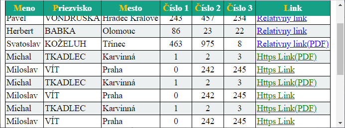

<div class="hidden">

> ## Rozcestník
> - [Späť na úvod](../../README.md)
> - Repo: [Štartér](/../../tree/main/css/selectors), [Riešenie](/../../tree/solution/css/selectors).
> - [Zobraziť riešenie](riesenie.md)
</div>

# Selektory
<div class="info"> 

**Hlavný jazyk príkladu**: CSS

**Ostatné použité jazyky**: HTML

**Obťažnosť**: 2/5

**Obsah príkladu**: Rôzne typy CSS selektorov pre výber elementov, formátovanie tabuliek a textu, tvorba rámčekov,farby pozadia a popredia, využitie obrázkov pozadia, rôzne pseudotriedy a pseudoelementy.  
</div>

## Zadanie

Naštýlujte pomocou CSS tabuľku podľa priloženého obrázku:



Riešenie musí spĺňať nasledovné podmienky:

1. Tabuľka bude mať čierny rámček medzi bunkami a okolo celej tabuľky.
2. Záhlavie tabuľky bude mať zelenú farbu pozadia, text bude tučným písmom a bude centrovaný, prvé písmeno bude mať žltú farbu.
3. Každý nepárny riadok tabuľky bude mať svetlosivé pozadie.
4. Stĺpec s priezviskami bude napísaný veľkými písmenami.
5. Pri umiestnení kurzor myši nad riadkom tabuľky sa stane:
    1. Celý riadok bude mať sivé pozadie.
    2. Text v stĺpci `Meno` bude mať červenú farbu, ale iba pokiaľ nebude kurzor myši v bunke s menom. Ak bude kurzor myši v bunke s menom, text bude mať štandardnú čiernu farbu.
    3. Bunky v stĺpcoch `Číslo 1` až `Číslo 3` budú mať nasledovné správanie:
        1. Vždy budú zarovnané na stred.
        2. Ak na nich nebude kurzor myši, tak budú mať modré pozadie.
        3. Ak bude kurzor myši na niektorom z nich, tak daná bunka bude mať zelené pozadie a bunka (bunky) s číslami za ním budú mať pozadie žlté. Pozor, bunke s odkazom nemeníme farbu pozadia.
           
    

6. V HTML je definovaný aj stĺpec `Výsledok`, ten vo výslednej tabuľke nezobrazujte.
7. Odkazy v stĺpci `Link` sa budú správať nasledovne:
    1. Ak bude odkaz zabezpečený (protokol HTTPS) zobrazte ho zelenou farbou.
    2. Ak bude odkaz nezabezpečený (protokol HTTP) zobrazte ho červenou farbou.
    3. Ak to bude relatívny odkaz, zobrazte ho modrou farbou.
    4. Ak to bude odkaz na súbor typu PDF (odkaz končí `.pdf`) dopíšte za text odkazu, že ide o PDF - `(PDF)`.
8. Zabezpečte, aby pri dlhej tabuľke zostávala hlavička vždy viditeľná.



#### Štruktúra HTML kódu

Štruktúra základného HTML vyzerá nasledovne (všimnite si 7. stĺpec `Výsledok`, ktorý sa v zobrazenej tabuľke nachádzať nemá) :

```html

<table class="data">
    <tr>
        <th>Meno</th>
        <th>Priezvisko</th>
        <th>Mesto</th>
        <th>Číslo 1</th>
        <th>Číslo 2</th>
        <th>Číslo 3</th>
        <th>Výsledok</th>
        <th>Link</th>
    </tr>
    <tr>
        <td>Hynek</td>
        <td>Borkovec</td>
        <td>Praha</td>
        <td>2453</td>
        <td>3546</td>
        <td>235</td>
        <td>1</td>
        <td><a href="https://google.sk">Https Link</a></td>
    </tr>

    ...

</table>
```

Štruktúru dokumentu neupravujte. Pre vypracovanie použite výlučne CSS.