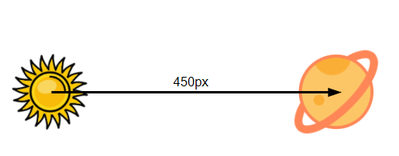
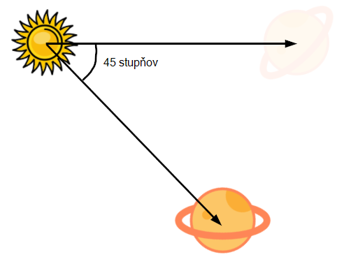
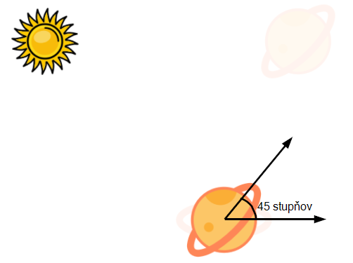
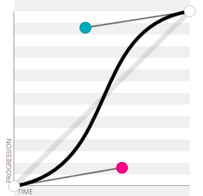

<div class="hidden">

> ## Rozcestník
> - [Späť na úvod](../../README.md)
> - Repo: [Štartér](/../../tree/main/css/solar-system), [Riešenie](/../../tree/solution/css/solar-system).

# Slnečná sústava (CSS)

</div>

## Riešenie

### HTML časť

Riešenie začneme prípravou HTML dokumentu. Na každú z planét vytvoríme vlastný HTML element. Pre lepšiu prehľadnosť a zjednodušenie zápisu CSS pravidiel ich umiestnime do spoločného elementu s triedou `system`. HTML kód bude vyzerať nasledovne:

```html
<div class="system">
    <div class="sun"></div>
    <div class="earth">
        <div class="moon"></div>
    </div>
    <div class="saturn"></div>
</div>
```

Element `system` obsahuje všetky prvky slnečnej sústavy. Mesiac sme umiestnili ako potomka elementu `earth`, pretože mesiac sa bude otáčať okolo zeme.

### Umiestnenie planét

Začneme s deklaráciou štýlu pre slnko. Pokiaľ chceme slnko umiestniť do stredu obrazovky, máme niekoľko možností. Buď použijeme *flexbox*, alebo pomocou nastavenia typu pozície (`absolute`) umiestníme prvok do stredu. V našom príklade *flexbox* potrebovať nebudeme a vystačíme si z absolútnym poziciovaním.

```css
.sun {
  width: 120px;
  height: 120px;
  position: absolute;
  left: 50%;
  top: 50%;
  background-image: url("images_solar-system/sun.png");
  background-size: cover;
  transform: translate(-50%, -50%);
}
```

Pomocou tohto štýlu sme nastavili veľkosť, pozíciu, pozadie a posunuli sme element cez transformáciu do stredu obrazovky. Môžeme si všimnúť, že vlastnosť `background-size` sme nastavili na `cover`, vďaka čomu sa nám obrázok prispôsobí veľkosti elementu. Pre vycentrovanie prvku na stred obrazovke sme využívali kombináciu `left` a `right` nastavených na `50%` a spätného posunu do stredu pomocou `translate(-50%, -50%)`. Túto kombináciu sme používali preto, lebo len pomocou `left` a `right` sme boli schopní vycentrovať ľavý horný roh nášho prvku. A kvôli centrovaniu na stred, bolo potrebné použiť `translate(-50%, -50%)`, ktoré posunulo prvok o polovicu jeho šíky/výšky smerom doľava a hore.

Ďalej budeme pokračovať zo štýlmi pre jednotlivé planéty. Začneme zo zemou:

```css
.earth {
     width: 80px;
     height: 80px;
     position: absolute;
     left: 50%;
     top: 50%;
     background-image: url("images_solar-system/earth.png");
     background-size: cover;
     transform: translate(-50%, -50%) translateX(300px);
 }
```

Pomocou tohto kódu sme nastavili zem veľmi podobným spôsobom ako slnko, jediný rozdiel v týchto deklaráciach je zmena veľkosti, obrázku a zem sme ešte navyše posunuli o `300px` doprava, aby sa zobrazila ďalej od slnka.

CSS kód pre ostatné planéty by bol veľmi podobný, tak môžeme skúsiť tento zápis zoptimalizovať. Určité vlastnosti môžeme nastaviť rovnako pre všetky elementy v našej sústave. Využijeme preto selektor `.system div`. Keď však skúsime napísať spoločné pravidlá pre všetky elementy, zistíme, že to budú vlastne len štyri - `position`, `left`, `top` a `background-size`. Veľkosti a transformácie sa budú meniť.

Pomocou CSS premenných by sme si mohli ešte viac zovšeobecniť tento zápis, pretože naše prvky majú rovnakú výšku a šírku, takže konkrétny prvok slnečnej sústavy by mohol zadeklarovať len tento rozmer.

Upravený kód pomocou CSS premenných by mohol vyzerať nasledovne:

```css
.system div {
    width: var(--size);
    height: var(--size);
    position: absolute;
    background-size: cover;
    left: calc(50% - (var(--size) / 2));
    top: calc(50% - (var(--size) / 2));
    transform: translateX(var(--orbitRadius));
}

.sun {
    --size: 120px;
    --orbitRadius: 0;
    background-image: url("images_solar-system/sun.png");
}

.earth {
    --size: 80px;
    --orbitRadius: 300px;
    background-image: url("images_solar-system/earth.png");
}

.saturn {
    --size: 150px;
    --orbitRadius: 450px;
    background-image: url("images_solar-system/saturn.png");
}
```

Pre každý element v slnečnej sústave sme zadeklarovali výšku a šírku pomocou premennej. Zápis `var(--size)` získa hodnotu premennej `--size`. Ďalšou úpravou bol spôsob centrovania elementu. V pôvodnej verzii sme využívali kombináciu `left` a `right` nastavenú na `50%` a spätného posunu do stredu pomocou `translate(-50%, -50%)`. Využitie vlastnosti `transform` nie je ale úplne dobrý napad, pretože túto CSS vlastnosť ešte budeme potrebovať pri animáciach, čo by znamenalo, že túto transformáciu by sme museli používať aj pri animáciach. Využitie `translate(-50%, -50%)` je hlavne dobré vtedy, keď dopredu nepoznáme šírku prvku, ktorý chceme zarovnávať. Ak poznáme šírku zarovnávaného elementu, môžeme si vystačiť len s vlastnosťami `left` a `right` a funkciou `calc`, ktorá nám dynamicky spočíta umiestnenie elementu.

V našom konkrétnom príklade sme použili na prvý pohľad komplikovaný výpočet `calc(50% - (var(--size) / 2))`. Tento výpočet hovorí, že element bude umiestnený naľavo 50% šírky stránky mínus jeho šírka delené dva. Čím dostaneme presné umiestnenie v strede obrazovky a rovnaký kód použijeme aj na umiestnenie elementu od vrchu stránky.

### Otáčanie planéty

Pre animáciu otáčania už máme pripravené všetko potrebné. Poďme sa pozrieť, akým spôsobom vieme nejakú planétu - napr. saturn otočiť okolo slnka. Začali sme s tým, že všetky planéty a slnko sú umiestnené na stred obrazovky a potom pomocou `translateX` sme ich posunuli smerom napravo na svoju orbitu.



Pokiaľ pred posun planéty vložíme otočenie, môžeme tým kontrolovať uhol, pod ktorým sa naša planéta vzdiali od slnka. Napríklad, ak vložíme pred `translateX(450px)` otočenie o 45 stupňov - `rotate(45deg)`, tak dostaneme:



Planétka je síce otočená okolo slnka o 45 stupňov, ale pribudol ďalší problém. Planétka sa otočila okolo svojej osi. Ak to chceme vrátiť späť, tak za posun (`translateX(450px)`) doplníme rotáciu v opačnom smere, ktorá otočí planétu na aktuálnej pozícii o 45 stupňov späť. Celkový zápis otočenia planétky presne o 45 stupňov bude nasledovný:

```css 
    transform: rotate(45deg) translateX(450px) rotate(-45deg);
```



#### Animácia obehu planétky

Pre animáciu pohybu nám stačí jednoducho meniť uhol planétky postupne od 0 do 360 stupňov. Napíšeme si jednoduchú animáciu:

```css
@keyframes circularOrbit {
    from {
        transform: rotate(0deg) translateX(var(--orbitRadius)) rotate(0deg);
    }
    to {
        transform: rotate(360deg) translateX(var(--orbitRadius)) rotate(-360deg);
    }
}
```

Táto animácia využíva metódu popísanú v predchádzajúcej časti. Okrem toho, aby sme túto animáciu spravili univerzálne použiteľnú, na veľkosť orbity sme použili CSS premennú, ktorú sme si pomenovali `--orbitRadius`.

Finálna definícia elementu, napríklad pre saturn s aplikovanou animáciou môže vyzerať nasledovne:

```css
.saturn {
    --size: 150px;
    --orbitRadius: 450px;
    background-image: url("images_solar-system/saturn.png");
    animation: circularOrbit 8s linear infinite;
}
```

Vzhľadom na univerzálnosť celého návrhu bude pridanie mesiaca úplne rovnaké:

```css
.moon {
    --size: 40px;
    --orbitRadius: 80px;
    background-image: url("images_solar-system/moon.png");
    animation: circularOrbit 2s linear infinite;
}
```

Mesiac využíva rovnaké vlastnosti ako ostatné planéty, len centrum jeho obežnej dráhy nie je stred obrazovky, ale planétka zem. Ďalším rozdielom je rýchlosť animácie, v prípade saturnu trvá jeden obeh `8s` a v prípade mesiaca `2s`.

### Nerovnomerná rýchlosť obehu

V zápise animácie môžeme definovať tzv. *timing* funkciu. V uvedenom príklade bola ako *timing* funkcia zvolená funkcia `linear`, ktorá sa správa tak, že planétky sa pohybujú rovnako rýchlo po celý čas obehu. Tieto *timing* funkcie sa definujú pomocou kubických bezierových kriviek. Našťastie si tieto krivky nemusíme počítať manuálne, ale môžeme využiť online nástroj - napríklad [cubic-bezier.com](https://cubic-bezier.com). Môžeme napríklad vyskúšať funkciu `cubic-bezier(.61,.11,.41,.91)`, ktorá spôsobí, že zo začiatku planétka pôjde veľmi pomaly, postupne bude zrýchlovať, v polovici otáčky pôjde najrýchlejšie a na konci zas spomalí. Spomenutá *timing* funkcia vyzerá nasledovne:



### Vykreslenie orbitálnych dráh

Pre lepšiu grafickú predstavu si môžeme pridať vykreslenie orbitálnych dráh jednotlivých planét. Pre tento účel mierne upravíme HTML:

```html
<div class="system">
    <div class="earth orbit"></div>
    <div class="saturn orbit"></div>

    <div class="sun"></div>
    <div class="earth">
        <div class="moon orbit"></div>
        <div class="moon"></div>
    </div>
    <div class="saturn"></div>
</div>
```

Do pôvodného kódu sme pridali nové elementy, ktoré budú použité na vykreslenie dráh. Samotné CSS na vykreslenie dráhy bude nasledovné:

```css
.system .orbit {
    --size: calc(var(--orbitRadius) * 2);
    border: 1px dotted black;
    border-radius: 50%;
    animation: none;
    transform: none;
    background: none;
}
```

V tomto CSS môžeme vidieť niekoľko zaujímavých vecí. Samotná orbita, keď sa pozrieme a HTML má okrem CSS triedy `orbit` aj triedu definujúcu príslušnú planétu. Takže orbite sa nastaví pozícia podobne ako planéte. Na rozdiel od planéty mu ale musíme zrušiť obrázok pozadia, animáciu a posunutie, pretože orbita sa má zobrazovať vycentrovaná na stred (okna prehliadača alebo v prípade mesiaca materskej planéty). Ďalšou zaujímavosťou je spôsob, akým nastavujeme veľkosť. Veľkosť elementu pre orbitu spočítame dynamicky na základe polomeru obežnej dráhy príslušnej planéty.
