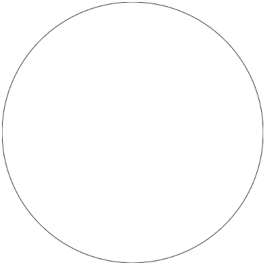
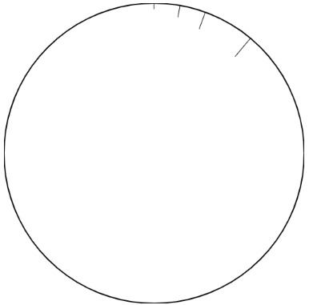
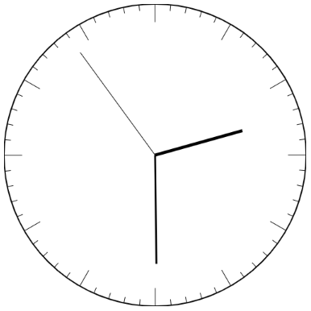
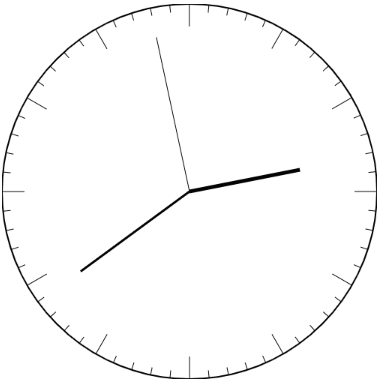

<div class="hidden">

> ## Rozcestník
> - [Späť na úvod](../../README.md)
> - Repo: [Štartér](/../../tree/main/js-a-css/analog-clock), [Riešenie](/../../tree/solution/js-a-css/analog-clock)
> - [Zobraziť zadanie](zadanie.md)

# Analógové hodinky (JS, CSS)
</div>

## Riešenie

Pri riešení tejto úlohy budeme používať iba JavaScript a vykresľovanie pomocou plátna [canvas](https://www.w3schools.com/html/html5_canvas.asp). Vykresľovať budeme do elementu `canvas` a nastavíme mu pevný rozmer `500px x 500px`. HTML súbor bude vyzerať nasledovne:

```html
<!DOCTYPE html>
<html lang="en">
    <head>
        <meta charset="UTF-8">
        <title>Title</title>
    </head>
    <body>
        <canvas width="500" height="500"></canvas>
    </body>
</html>
```

Kreslenie na plátne používa uhly v radiánoch. Pre nás bude lepšie, ak budeme môcť zadávať uhly v stupňoch.

Konveziu zo stupňov realizujeme nasledovným prepočtom: `uhol v radianoch = uhol v stupňoch * PI / 180`, kde `PI / 180 = 0.01745329251`. Môžeme si na to vytvoriť nasledovnú konverznú funkciu:

```javascript
function degToRad(d)
{
    return d * 0.01745;
}
```

Ako prvé nakreslíme kruh, ktorý bude vypĺňať cely obsah elementu `canvas` a bude zarovnaný na jeho stred. Na to potrebujeme získať referenciu na `HTMLElement` a `context`, pomocou ktorého vieme naň kresliť. To realizujeme nasledovným kódom:

```javascript
window.onload = function(){
    let canvas = document.querySelector("canvas");
    let ctx = canvas.getContext("2d");
}
```

Kreslenie kruhu sa realizuje použitím metódy contextu [`CanvasRenderingContext2D.arc()`](https://developer.mozilla.org/en-US/docs/Web/API/CanvasRenderingContext2D/arc). Táto metóda potrebuje zadať _polohu stredu_, _rádius_, _začiatočný_ a _koncový uhol_ kreslenia. Pred samotnou definíciou metódy `arc()` je potrebné nastaviť kontextu, že chceme definovať novú postupnosť krokov pre vykreslenie pomocou metódy [`CanvasRenderingContext2D.beginPath()`](https://developer.mozilla.org/en-US/docs/Web/API/CanvasRenderingContext2D/beginPath). Následne až môžeme definovať, čo chceme kresliť. Toto ale nestačí, samotný pokyn pre vykreslenie vykonáme pomocou metódy [`CanvasRenderingContext2D.stroke()`](https://developer.mozilla.org/en-US/docs/Web/API/CanvasRenderingContext2D/stroke), ktorá na základe príkazov vykreslí požadovanú grafiku do elementu `canvas`.

V našom prípade bude kód, ktorý nakreslí kruh, vyzerať nasledovne:

```javascript
window.onload = function(){
  let canvas = document.querySelector("canvas");
  let ctx = canvas.getContext("2d");

  ctx.beginPath();
  ctx.arc(250, 250, 250, 0, degToRad(360));
  ctx.stroke();
}
```
Výsledkom skriptu je takýto kruh:



### Vykreslenie ručičiek

Teraz si vytvoríme funkciu, ktorú budeme používať pre vykreslenie sekundovej, minútovej a hodinovej ručičky. Funkcia musí umožňovať definovať šírku a dĺžku ručičky od stredu, ako aj jej uhol.

Predpokladáme, že `canvas` má pevne stanovený rozmer, teda východzí bod pre kreslenie ručičiek bude bod `x=250, y=250`. Pre presunutie pera kreslenia na túto pozíciu použijeme metódu [`CanvasRenderingContext2D.moveTo()`](CanvasRenderingContext2D.moveTo()). 

Následne potrebujeme urobiť z východzieho bodu čiaru na bod, ktorý je definovaný uhlom a vzdialenosťou. Na toto použijeme goniometrické funkcie `Math.cos()` a `Math.sin()`<span class="hidden">([viac info tu](https://stackoverflow.com/questions/23598547/draw-a-line-from-x-y-with-a-given-angle-and-length/23598710) alebo učebnica matematiky ;) )</span>. Čiaru do daľšieho bodu nakreslíme pomocou metódy [`CanvasRenderingContext2D.lineTo()`](https://developer.mozilla.org/en-US/docs/Web/API/CanvasRenderingContext2D/lineTo).

Hrúbku čiary upravíme nastavením atribútu [`CanvasRenderingContext2D.lineWidth`](https://developer.mozilla.org/en-US/docs/Web/API/CanvasRenderingContext2D/lineWidth).

Zostáva ešte posunúť uhol vykreslenia ručičiek, tak aby hodnota `0` zodpovedala pozícii na 12. hodine. To realizujeme jednoducho prirátaním hodnoty `270` k pôvodne zadanému uhlu: 

```javascript
function drawWatchHand(ctx, uhol, length, width){
    let x = 250;
    let y = 250;
    let angl = degToRad(uhol + 270);

    ctx.beginPath();
    ctx.lineWidth = width;
    ctx.moveTo(x, y);
    ctx.lineTo(x + length * Math.cos(angl), y + length * Math.sin(angl));
    ctx.stroke();
}
```

Kód vykreslenia ciferníka presunieme do funkcie `drawCircle()`:

```javascript
function drawCircle(ctx){
    ctx.lineWidth = 2;
    ctx.beginPath();
    ctx.arc(250, 250, 250, 0, degToRad(360));
    ctx.stroke();
}
```

Teraz si skúsime vykresliť ciferník a nejaké ručičky, aby sme si otestovali správnosť logiky nasledovne: 

```javascript
window.onload = function(){
  let canvas = document.querySelector("canvas");
  let ctx = canvas.getContext("2d");

  drawCircle(ctx);
  drawWatchHand(ctx, 0, 200, 5);
  drawWatchHand(ctx, 90, 210, 1);
  drawWatchHand(ctx, 190, 100, 15);
}
```

Výsledná kresba by mala vyzerať nasledovne:


### Vykreslenie ciferníka 

Pre vykreslenie hodinových a minútových značiek vytvoríme novú funkciu `drawLineMarker()`. Tá bude obsahovať mierne upravený kód funkcie `drawWatchHand()`.

Rozdiel bude v tom, kde sa bude daná značka začínať vykreslovať. Minútová alebo hodinová značka je čiara okolo ciferníka, ktorá smeruje smerom do jeho stredu, pričom jej dĺžka je kratšia ako sekundová.

Pri vykreslovaní teda začíname v strede, následne sa pod daným uhlom posunieme a až následne kreslíme čiaru v danej dĺžke až po okraj ciferníka. 

Funkcia `drawLineMarker()` bude vyzerať nasledovne:

```javascript
function drawLineMarker(ctx, uhol, markerLength){

    let angl = degToRad(uhol + 270);
    let r = 250 - markerLength;

    let sx = 250  + r * Math.cos(angl);
    let sy = 250 + r * Math.sin(angl);

    ctx.beginPath();
    ctx.lineWidth = 1;
    ctx.moveTo(sx,sy );
    ctx.lineTo(sx + markerLength * Math.cos(angl), sy + markerLength * Math.sin(angl));
    ctx.stroke();
}
```

Môžeme ju otestovať nasledovným kódom:

```javascript
window.onload = function(){
  let canvas = document.querySelector("canvas");
  let ctx = canvas.getContext("2d");

  drawCircle(ctx);
  drawLineMarker(ctx, 0, 10);
  drawLineMarker(ctx, 10, 20);
  drawLineMarker(ctx, 20, 30);
  drawLineMarker(ctx, 40, 40);
}
```
Vykreslí sa:




### Vykreslenie ciferníka

Samotné vykreslenie ciferníka budeme vytvárať v samostatnej funkcii `makeTick()`. Jej úlohou bude vykresliť aktuálny lokálny čas na ciferník.

Začneme najprv vykreslením hranice ciferníka zavolaním funkcie `drawCircle()`. Následne vytvoríme cyklus, ktorým budeme vykresľovať jednotlivé hodinové a minútové značky. Vieme, že kruh má 360 stupňov. Má *12 hodinových značiek* a každý hodinový úsek je rozdelený na *5 minútových úsekov*. Tým pádom kreslíme značku každých `360 / 12 / 5 = 6` stupňov.

Môžeme to pre prehľadnosť zapísať ako nasledujúci `for` cyklus: `for(let i = 0 ; i < (360/6) ; i++)`. 

Zostáva nám už iba oddeliť hodinové značky od minútových pomocou rôznej veľkosti. Hodinová značka má byť vykreslená každých `360 / 12 = 30` stupňov. To môžeme kontrolovať podmienkou, či je aktuálna hodnota premennej `i` deliteľná hodnotou `30` bezo zvyšku podmienkou `if (i*6 % 30 == 0)` a ak áno, nakreslíme značku dlhšiu.

Celý kód bude vyzerať následovne:

```javascript
function makeTick(ctx){
   
    drawCircle(ctx);
    // cifernik
    for(let i = 0 ; i < (360 / 6) ; i++) {
        if (i * 6 % 30 == 0) {
            drawLineMarker(ctx, i*6, 30)
        } else {
            drawLineMarker(ctx, i*6, 10)
        }
    }
}
```
Ciferník bude vyzerať takto:

 

Teraz doplníme do zobrazenia ručičky a ich jednotlive uhly vyrátame týmto spôsobom:

- *Sekundová ručička* - sekúnd je v jednej minúte *60*, tým pádom nám stačí akutálny počet sekúnd vynásobiť hodnotou `360 - 60 = 6`. Prepočet sekúnd na uhol sekundovej ručičky môžeme zapísať ako `sekundy * 6`. 
- *Minútová ručička* - hodina má *60* minút, čo tvorí uhol minúty *6* stupňov. Pozíciu musíme ešte doplniť o posun sekúnd tak, že 6 rozdelíme na 60 sekúnd t.j. `6/60 = 0.1`. Prepočet minút a sekúnd na uhol minútovej ručičky môžeme zapísať ako `minúty * 6 + sekundy * 0.1`. 
- *Hodinová ručička* - hodiny majú na ciferníku je *12*, teda hodina má `360 / 12 = 30` stupňov. Pre upresnenie pozície ešte prirátame posun o minúty, t.j. minúty budeme násobiť `30 / 60 = 0.5`. Prepočet hodín a minút na pozíciu hodinovej ručičky 12 hodinových hodín môžeme zapísať ako `hodiny * 30 + minuty *0.5`. 

V JavaScripte získame aktuálny čast vytvorením novej inštancie triedy [`Date`](https://developer.mozilla.org/en-US/docs/Web/JavaScript/Reference/Global_Objects/Date). Tá obsahuje atribúty `Date.getSeconds()`,`Date.getMinutes()` a `Date.getHours()`. 

`Date.getHours()` síce vracia hodnotu v 24 hodinovom formáte, ale kedže sa táto hodnota preratúva na uhol nebude to mať žiaden vplyv na výsledne zobrazenie. 

Funkcia `makeTick()` bude po doplnení: 

```javascript
function makeTick(ctx){
   
    drawCircle(ctx);
    // cifernik
    for(let i = 0 ; i < (360 / 6); i++) {
        if (i * 6 % 30 == 0) {
            drawLineMarker(ctx, i * 6, 30)
        } else {
            drawLineMarker(ctx, i * 6, 10)
        }
    }
    let time = new Date();
    drawWatchHand(ctx, time.getSeconds() * 6, 210, 1);
    drawWatchHand(ctx, time.getMinutes() * 6 + time.getSeconds() * 0.1, 180, 3);
    drawWatchHand(ctx, time.getHours() * 30 + time.getMinutes() * 0.5, 150, 5);
}
```
Hodiny sa zobrazia nasledovne:



Ako posledné potrebujeme, aby sa funkcia `makeTick()` spúšťala každú sekundu a vytvoril sa tak dojem, že sa hodiny idú. To docielime periodickým spúštaním za pomoci metódy [`setInterval()`](https://www.w3schools.com/jsref/met_win_setinterval.asp) každú sekundu.

Budeme však musieť `canvas` pred každým prekreslením vyčistiť (celý premaľovať na bielo) pomocou [`CanvasRenderingContext2D.clearRect()`](https://developer.mozilla.org/en-US/docs/Web/API/CanvasRenderingContext2D/clearRect), inak by na ňom zostávali pôvodné čiary.

Upravená funkcia `makeTick()`:

```javascript
function makeTick(ctx){

    ctx.clearRect(0, 0, 500, 500);
    
    drawCircle(ctx);
    // cifernik
    for(let i = 0 ; i < (360 / 6); i++) {
        if (i * 6 % 30 == 0) {
            drawLineMarker(ctx, i * 6, 30)
        } else {
            drawLineMarker(ctx, i * 6, 10)
        }
    }
    let time = new Date();
    drawWatchHand(ctx, time.getSeconds() * 6, 210, 1);
    drawWatchHand(ctx, time.getMinutes() * 6 + time.getSeconds() * 0.1, 180, 3);
    drawWatchHand(ctx, time.getHours() * 30 + time.getMinutes() * 0.5, 150, 5);
}
```

A na záver pridáme spúšťanie v `window.onload`:

```javascript
window.onload = function(){
    let canvas = document.querySelector("canvas");
    let ctx = canvas.getContext("2d");
    
    setInterval( function() {
        makeTick(ctx);
    }, 1000);
    makeTick(ctx);
}
```

Výsledok:

