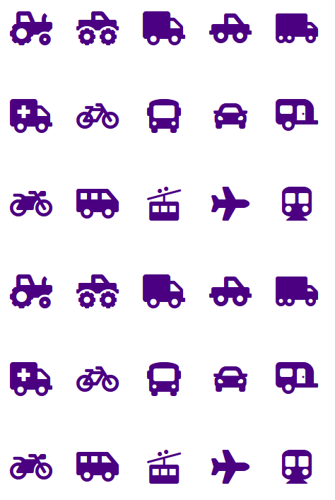
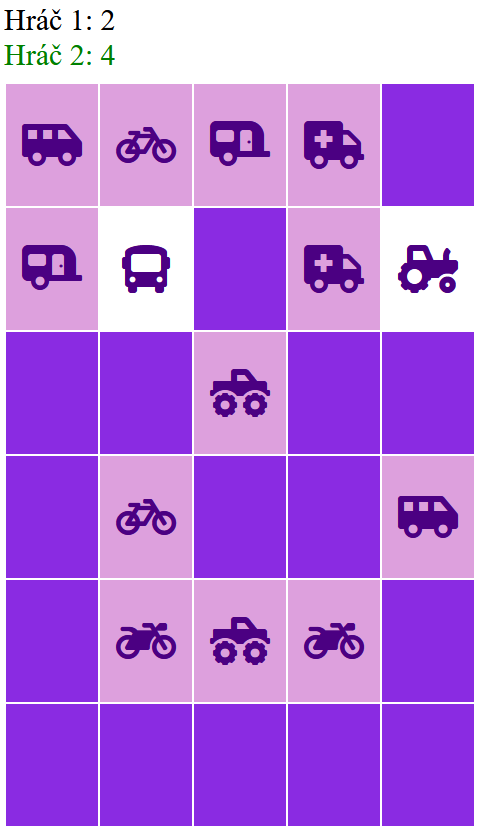

<div class="hidden">

> ## Rozcestník
> - [Späť na úvod](../../README.md)
> - Repo: [Štartér](/../../tree/main/js/memory-game), [Riešenie](/../../tree/solution/js/memory-game)
> - [Zobraziť riešenie](riesenie.md)

# Pesexo (JS, CSS)

</div>

## Riešenie

Celé riešenie sa bude skladať z troch súborov: `index.html`, `style.css`, `script.js`. Logika aplikácie sa bude vykonávať v JavaScripte, HTML a CSS využijeme len na tvorbu základnej hracej plochy.

### HTML základ

Táto časť aplikácie je veľmi jednoduchá, tvorí ju súbor `index.html`, v ktorom importujeme ostatné časti aplikácie (CSS a JS) a vykresľujeme len začiatočné nastavenie celej hry. Žiadny grafický dizajn ani logika aplikácie sa tu nenachádza, aby sme dodržali pravidlo, že každý typ súboru obsahuje len to, čo je jeho úlohou.

Knižnicu `font-awesome` pripojíme pomocou dole uvedeného riadku. Využijeme súbor dostupný na internete bez nutnosti sťahovania z webu. Ten spôsob pripojovania využíva *Content delivery network* (CDN). Kód pre pripojenie `font-awesome` ikon vyzerá nasledovne:

```html
<link rel="stylesheet" href="https://cdnjs.cloudflare.com/ajax/libs/font-awesome/5.15.3/css/all.min.css">
```

Hracia plocha sa skladá z dvoch popiskov a počítadla skóre pre každého hráča, tabuľky a tlačidla na rozdanie kariet. Tabuľka bude slúžiť ako herné pole pexesa a budú v nej poukladané všetky karty. Keďže herné pole pexesa je matica, tabuľka nám dizajnovo poslúži ako základ. Samotné karty nebudeme pre pracnosť vytvárať v HTML, ale vytvoríme ich v skripte. Úvodné prostredie hry bude vyzerať takto:

```html
<div id="score">
    <div id="player1">
        Hráč 1:
        <span id="player1_guessed">0</span>
    </div>
    <div id="player2">
        Hráč 2:
        <span id="player2_guessed">0</span>
    </div>
</div>
<table id="board"></table>
<button id="start">Rozdaj karty</button>
```

Vzhľad hry pred začiatkom je na nasledovnom obrázku:


Dôležité je pridanie CSS atribútov `id` k tým atribútom, ktoré budeme neskôr v skripte nastavovať, napr. hodnoty skóre jednotlivých hráčov. Podobne označíme aj tlačidlo, aby sme mu mohli neskôr priradiť činnosť, ktorá bude nasledovať po stlačení tlačidla.

### CSS štýl

Úlohou tejto časti aplikácie, nachádzajúcej sa v súbore `style.css` je grafické nastavenie jednotlivých prvkov hry. Tu sa ukazuje výhoda, že sme si označili tabuľku atribútom `id`, pretože môžeme použiť potomkový selektor, aby sme štýl aplikovali len na elementy, ktoré budú vo vnútri tabuľky. Ako je vidieť z nastavenia štýlu, každá karta pexesa bude mať 90 x 120 pixelov a farba pozadia bude určovať farbu chrbta karty. Druhé nastavenie štýlu bude mať za úlohu skryť obrázok (ikonu), ktorá sa na karte nachádza, aby ju nebolo vidieť:

```css
#board td {
    width: 90px;
    height: 120px;
    text-align: center;
    background-color: BlueViolet;
}
#board td i {
    opacity: 0;
    color: Indigo;
}
```

### Logika hry

#### Inicializácia nastavení hry

Celá logika hry sa bude vytvárať v JavaScript súbore `script.js`. V hre si budeme potrebovať pamätať niekoľko údajov, preto si inicializujeme premenné. Prvé štyri premenné budú obsahovať skóre hráča. Premenné `card1` a `card2` budú predstavovať aktuálne odokryté karty. Pole `cardSymbols` bude obsahovať zoznam ikon, ktoré použijeme na tvorbu kariet. Bude ich presne 15, pretože máme 30 kariet (15 dvojíc). Kvôli prehľadnosti si vytvoríme pole od indexu 1 (JavaScript, podobne ako iné jazyky používa ako prvý index poľa 0), aby sa nám s ním lepšie pracovalo. To je dôvod, prečo je prvá hodnota poľa prázdny reťazec.

```javascript
let reversedCards = 0;
let player1GuessedCount = 0;
let player2GuessedCount = 0;
let card1 = null;
let card2 = null;
let cardSymbols = ['', 'tractor', 'truck-monster', 'truck', 'truck-pickup', 'truck-moving', 'ambulance', 'bicycle', 'bus',
    'car', 'caravan', 'motorcycle', 'shuttle-van', 'tram', 'plane', 'subway'];
```

#### Nastavenie obsluhy udalosti pre tlačidlo *Rozdaj karty*

Na začiatku si nastavíme obsluhu udalosti kliknutia na tlačidlo `Rozdaj karty`, pričom toto priradenie sa musí uskutočniť až potom, ako sú všetky elementy nahraté v prehliadači. Využijeme na to udalosť `onload`, ktorá nastane, keď je už kód stránky v prehliadači. Všimnite si, že priradenie udalosti sa vykoná pripradením názvu funkcie, nie jej zavolaním (v kóde nie sú zátvorky za `initialize`). Celý kód bude vyzerať nasledovne:

```javascript
function initialize() {
    document.getElementById("start").onclick = initializeGame;
}

window.onload = initialize;
```

#### Pomocná funkcia `gid()`

Keďže DOM metóda `document.getElementById()` má veľmi dlhý názov a bolo by otravné ju neustále celú písať, preto by bolo lepšie vytvoriť si pomocnú funkciu s parametrom ID elementu, ktorý chceme získať. V skripte je budeme často používať.

```javascript
function gid(elementId) {
    return document.getElementById(elementId);
}
```

#### Inicializácia hry

Na začiatku novej hry je nutné zmeniť hráča na Hráča 1 (napr. predošlú hru skončí Hráč 2). Na to slúži jednoduchá funkcia `changePlayer()`. V ďalšom kroku vynulujeme body hráčom, aby sme mohli začať počítať body odznovu. Opäť si vytvoríme jednoduchú funkciu `showScore()`, pretože ju rovnako budeme potrebovať na viacerých miestach skriptu. V ďalšom kroku rozdáme karty. Túto funkciu budeme implementovať v až ďalšom kroku.

```javascript
function initializeGame() {
    changePlayer("player1");
    player1GuessedCount = 0;
    showScore("player1", 0);
    player2GuessedCount = 0;
    showScore("player2", 0);

    distributeCards();
}
```

Funkcia `changePlayer()` bude len meniť farbu textu. Ako parameter dostane informáciu, kto bude nový hráč. Ten hráč, ktorý bude zobrazený zelenou farbou, bude na ťahu:

```javascript
function changePlayer(newPlayer) {
    if (newPlayer == "player1") {
        gid("player1").style.color = "green";
        gid("player2").style.color = "black";
    } else {
        gid("player1").style.color = "black";
        gid("player2").style.color = "green";
    }
}
```

Podobne jednoduchá je aj funkcia, ktorá zobrazí body. Parametrami tejto funkcie sú identifikácia hráča, nový počet ťahov a nový počet bodov. Jej úlohou je len zobraziť nový stav hodnôt:

```javascript
function showScore(player, guessed) {
    gid(player + "_guessed").innerHTML = guessed;
}
```

#### Rozdanie kariet

V HTML súbore sme si vytvorili prázdnu tabuľku a teraz si ju naplníme. Pomocou DOM vieme dynamicky vytvárať jednotlivé elementy, a to využijeme aj teraz. Najskôr vymažeme celú tabuľku príkazom `board.innerHTML = "";` a potom v cykle poukladáme karty vedľa seba. Keďže kariet je 15, musíme ich uložiť 2x za sebou. Na to využijeme ternárny operátor `?:`, a ak už sme rozdali 15 kariet, začneme znovu od prvej. Rozdávanie kariet je vlastne vytváranie buniek tabuľky postupne po riadkoch (na to slúžia dva zanorené cykly) a pomocou DOM funkcie `document.createElement()` vytvoríme postupne riadky a stĺpce tabuľky. Obsahom bunky bude ikona z `font-awesome`, ktorá na zobrazenie ikony využíva značku `<i class="fas fa-car"></i>`. Každej bunke nastavíme obsluhu `onclick`, kde budeme riešiť, čo sa má stať, keď hráč klikne na nejakú kartu. Táto obsluha bude spoločná pre všetky karty. Výsledná funkcia bude vyzerať takto:

```javascript
function distributeCards() {
    let board = gid("board");
    board.innerHTML = "";
    let n = 1;
    for (let i = 1; i <= 6; i++) {
        let row = document.createElement("tr");
        board.appendChild(row);
        for (let j = 1; j <= 5; j++) {
            let cell = document.createElement("td");
            cell.onclick = turnCard;
            cell.innerHTML = '<i class="fas fa-' + cardSymbols[(n > 15 ? n - 15 : n)] + ' fa-3x"></i>';
            row.appendChild(cell);
            n++;
        }
    }
    shuffleCards();
}
```

Ak chcete zobraziť karty na ploche, v CSS súbore stačí nastaviť `opacity: 1;`. Po tomto kroku budú karty usporiadané nasledovne:



Takáto hra by však bola veľmi jednoduchá, preto potrebujeme karty premiešať. Tento problém vyriešime presne tak, aby sme hrali pexeso s papierovými kartami. Presne definovaný počet krát vymeníme pozície náhodne vybratých kariet. Tým dosiahneme, že karty už nebudú usporiadané za sebou. Funkcia využije DOM metódu `querySelectorAll()`, ktorá vráti pole všetkých elementov rodiča uvedeného ako parameter. Potom v cykle 100 vymeníme vnútorný obsah dvoch náhodne vybraných elementov a tým karty zamiešame. Kód funkcie bude vyzerať nasledovne:

```javascript
function shuffleCards() {
    let cards = gid('board').querySelectorAll('td');
    for (i = 0; i < 100; i++) {
        let from = Math.floor(Math.random() * 30);
        let to = Math.floor(Math.random() * 30);
        [cards[from].innerHTML, cards[to].innerHTML] = [cards[to].innerHTML, cards[from].innerHTML]
    }
}
```

Zamiešané karty sa môžu zobraziť napr. takto:


#### Implementácia hernej logiky 

Po zamiešaní kariet, získame hracie pole a znovu nastavíme `opacity: 0;`, aby karty skryli. Teraz musíme vytvoriť logiku hry. Akcia v hre sa vykonáva, keď nejaký hráč klikne myšou na kartu. Pri rozdávaní kariet sme každej bunke definovali ako obsluhu udalosti `onclick` funkciu `turnCard()`. V tejto funkcii musíme najskôr zistiť, či sa karta má vôbec otočiť, keď na ňu klikneme. Kartu neotočíme, ak:

- počet už otočených kariet je 2,
- hráč klik na kartu, ktorá je práve vybratá,
- hráč klikne na kartu, ktorá je už bola uhádnutá. Tieto operácie rieši táto časť funkcie:

```javascript
if (reversedCards == 2) return;
if (this.style.backgroundColor == "plum" || this.style.backgroundColor == "white") return;
```

Ak nie je splnená žiadna z vyššie uvedených podmienok, zobrazíme kartu, na ktorú klikol a to tak, že jej nastavíme farbu pozadia na bielu a priehľadnosť na 1. Ak je zatiaľ otočená len jedna karta, zvyšime si počet obrátených kariet, prvú kartu si zapamätáme a necháme hráča vybrať druhú kartu.

```javascript
this.style.backgroundColor = "white";
this.firstChild.style.opacity = 1;
reversedCards++;

if (reversedCards == 1) {
    card1 = this;
    return;
}
```

Ak máme dve karty, možeme začať vyhodnocovanie, či sú karty rovnaké. Karty sú rovnaké, keď obsahujú tú istú ikonu, preto nám stačí kontrolovať DOM vlastnosť `innerHTML`.

```javascript
if (card1.innerHTML == card2.innerHTML) {
```

Ak sa karty rovnajú, karty označíme ako uhádnuté zmenou pozadia, hráčovi pripočítame bod a zobrazíme jeho skóre. Na záver vynulujeme počet obrátených kariet:

```javascript
card1.style.backgroundColor = "plum";
card2.style.backgroundColor = "plum";
if (gid("player1").style.color == 'green') {
    player1GuessedCount++;
    showScore("player1", player1GuessedCount);
} else {
    player2GuessedCount++;
    showScore("player2", player2GuessedCount);
}
reversedCards = 0;
```

Ak sa karty nerovnajú,karty otočíme naspäť a na ťahu je druhý hráč. Tu musíme využiť časovač, aby sme hráčovi neskryli karty hneď, ale až napr. po jednej sekunde, aby si stihol prezrieť aj druhú kartu. Nesmieme zabudnúť počet obrátených kariet nastaviť na 0.

```javascript
if (gid("player1").style.color == 'green') {
    changePlayer("player2");
} else {
    changePlayer("player1");
}
setTimeout(function () {
    hideCards(card1, card2);
    reversedCards = 0;
}, 1000);
```

Celá funkcia bude vyzerať nasledovne:

```javascript
function turnCard() {
    if (reversedCards == 2) return;
    if (this.style.backgroundColor == "plum" || this.style.backgroundColor == "white") return;

    this.style.backgroundColor = "white";
    this.firstChild.style.opacity = 1;
    reversedCards++;

    if (reversedCards == 1) {
        card1 = this;
        return;
    }
    if (reversedCards == 2) {
        card2 = this;
        if (card1.innerHTML == card2.innerHTML) {
            card1.style.backgroundColor = "plum";
            card2.style.backgroundColor = "plum";
            if (gid("player1").style.color == 'green') {
                player1GuessedCount++;
                showScore("player1", player1GuessedCount);
            } else {
                player2GuessedCount++;
                showScore("player2", player2GuessedCount);
            }
            reversedCards = 0;
        } else {
            if (gid("player1").style.color == 'green') {
                changePlayer("player2");
            } else {
                changePlayer("player1");
            }
            setTimeout(function () {
                hideCards(card1, card2);
                reversedCards = 0;
            }, 1000);
        }
    }
}
```

Poslednou funkciou je funkcia `hideCards()`, ktorej úlohou je len skryť odkryté karty. Upozorniť by sme hlavne chceli na použitie vlastnosti `firstChild`, keďže priehľadnosť musíme nastaviť prvku, ktorý bezprostredne nasleduje až po prvku, na ktorý sme klikli. Funkcia je jednoduchá a nastaví okrem priehľadnosti aj farbu pozadia na farbu chrbta karty:

```javascript
function hideCards(card1, card2) {
    card1.style.backgroundColor = "blueviolet";
    card1.firstChild.style.opacity = 0;
    card2.style.backgroundColor = "blueviolet";
    card2.firstChild.style.opacity = 0;
}
```

Priebeh rozohratej hry je možné vidieť na nasledovnom obrázku (hráč 2 práve odkryl 2 karty):



Tým sme implementovali celú logiku hry. Koniec hry sme neriešili, ale nebol by problém detegovať, či sú všetky karty odkryté, vyhlásiť víťaza a opýtať sa, či si chcú hráči hru zahrať znovu. 

