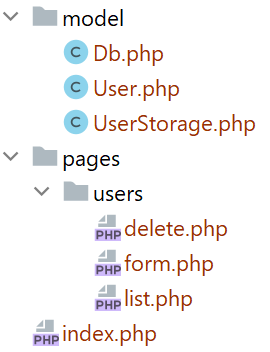
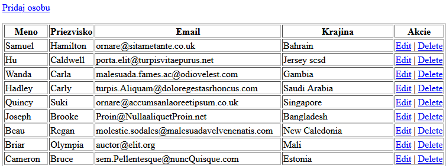
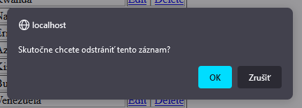

<div class="hidden">

> ## Rozcestník
> - [Späť na úvod](../../README.md)
> - Repo: [Štartér](/../../tree/main/php/crud), [Riešenie](/../../tree/solution/php/crud).
> - [Zobraziť zadanie](zadanie.md)

# Operácie nad tabuľkou (PHP)

</div>

## Riešenie

<div class="hidden">

> Toto riešenie obsahuje všetky potrebné služby v `docker-compose.yml`. Po ich spustení sa vytvorí:
> - webový server, ktory do __document root__ namapuje adresár tejto úlohy s modulom __PDO__. Port __80__ a bude dostupný na adrese [http://localhost/](http://localhost/). Server má pridaný modul pre ladenie [__Xdebug 3__](https://xdebug.org/) nastavený na port __9000__.
> - databázový server s vytvorenou _databázov_ a tabuľkou `users` s dátami na porte __3306__ a bude dostupný na `localhost:3306`. Prihlasovacie údaje sú:
>   - MYSQL_ROOT_PASSWORD: db_user_pass
>   - MYSQL_DATABASE: crud
>   - MYSQL_USER: db_user
>   - MYSQL_PASSWORD: db_user_pass
> - phpmyadmin server, ktorý sa automatický nastevený na databázový server na porte __8080__ a bude dostupný na adrese [http://localhost:8080/](http://localhost:8080/)

</div>

Samotné riešenie si rozdelíme na niekoľko častí.

### Príprava databázovej schémy a dát

Na úvod si pripravíme databázovú entitu, nad ktorou budeme robiť zadané operácie. Pripravíme si tabuľku `users`, ktorá bude obsahovať atribúty `name`, `surname`, `mail` a `country`.


DDL na definovanie tejto tabuľky je nasledovné:

```sql
CREATE TABLE `users`
(
    `id`      mediumint(8) unsigned NOT NULL auto_increment,
    `name`    varchar(255) default NULL,
    `surname` varchar(255) default NULL,
    `mail`    varchar(255) default NULL,
    `country` varchar(100) default NULL,
    PRIMARY KEY (`id`)
) AUTO_INCREMENT=1;
```

Do databázy pre testovacie účely vložíme niekoľko záznamov.


### Pripojenie k databáze

Pre čítanie dát z databázy existuje v jazyku PHP niekoľko prístupov. Každý DB systém môže mať vlastnú sadu tried (napr. [`mysqli()`](https://www.php.net/manual/en/book.mysqli.php) pre MySQL/MariaDB alebo [`pgsql()`](https://www.php.net/manual/en/book.pgsql.php) pre PostgreSQL). Okrem toho v PHP existuje unifikované rozhranie PHP Data Objects ([`PDO`](https://www.php.net/manual/en/book.pdo.php)), ktoré sa používa ako unifikovaná nadstavba nad rôznymi DBS.

V našom príklade si ukážeme prístup cez PDO, ktoré je v súčasnosti odporúčané využívať, pretože na rozdiel od ostatných prístupov, plne podporuje objektový prístup.

Hlavným prístupovým bodom k databáze je trieda [`PDO`](https://www.php.net/manual/en/class.pdo.php). Táto trieda umožní vytvoriť pripojenie k databáze a následne vykonávanie SQL príkazov. Pre vytvorenie jej inštancie potrebujeme zadať parametre [konštrukora](https://www.php.net/manual/en/pdo.construct.php).

- `connection string` - textový reťazec, ktorý obsahuje informácie o tom, kde sa nachádza databázový server, typ servera a názov použitej databázovej schémy.
- `db_user` - textový reťazec obsahujúci názov používateľského konta pre databázu.
- `password` - textový reťazec obsahujúci heslo používateľského konta pre databázu.

```php
try {
    $pdo = new PDO('mysql:host=db:3306;dbname=crud', "db_user", "db_user_pass");
    $pdo->setAttribute(PDO::ATTR_ERRMODE, PDO::ERRMODE_EXCEPTION);
} catch (PDOException $e) {
    exit("Error!: " . $e->getMessage());
}
```

Takto vytvorená inštancia PDO nás pripojí na `mysql` databázový server s názvom `db` bežiacom na porte `3306` s prihlasovacím menom `"db_user"` a heslom `"db_user_pass"`. V prípade, že sa pripojenie nepodarí (nesprávne meno heslo, nedostupný db server), ukončíme beh celého skriptu pomocou funkcie  [`exit()`](https://www.php.net/manual/en/function.exit.php).

Pre pohodlnejšiu prácu ešte nastavíme správanie PDO tak, že pri chybe dostaneme výnimku. Od PHP 8 je toto správanie predvolené, takže na PHP8 už `$pdo->setAttribute(PDO::ATTR_ERRMODE, PDO::ERRMODE_EXCEPTION);` nieje potrebné.

V aplikácii často pracujeme s rôznymi entitami, ale pripájame sa na rovnakú databázu. Dobrou praxou je pre to oddelenie pripojenia k databáze do vlastnej triedy, ktorú môžeme implementovať ako *singleton*, aby sme mali len jedno spoločné pripojenie k databáze. Spravíme pre to triedu `Db`, ktorá bude zaobaľovať túto funkcionalitu.

```php
class Db 
{
    private const DB_HOST = "db:3306";
    private const DB_NAME = "crud";
    private const DB_USER = "db_user";
    private const DB_PASS = "db_user_pass";

    private static ?PDO $connection = null;

    public static function conn(): PDO
    {
        if (Db::$connection == null) {
            self::connect();
        }
        return Db::$connection;
    }

    private static function connect()
    {
        try {
            Db::$connection = new PDO("mysql:host=".self::DB_HOST.";dbname=".self::DB_NAME, self::DB_USER, self::DB_PASS);
            Db::$connection->setAttribute(PDO::ATTR_ERRMODE, PDO::ERRMODE_EXCEPTION);
        } catch (PDOException $e) {
            die("Databáza nedostupná: " . $e->getMessage());
        }
    }
}
```

Trieda obsahuje jeden statický atribút `$connection` typu `PDO`, v ktorom sa uchováva inštancia pripojenia k databáze. Pripojenie k databáze z predchádzajúceho príkladu sme umiestnili do statickej metódy `Db::connect()`.

Pre prístup k pripojeniu využijeme statickú metódu `Db::conn()`, ktorá vráti (prípadne vytvorí) inštanciu `PDO`.

### Návrh objektovej štruktúry

Pre lepšiu organizáciu kódu si vytvoríme triedu na prácu s databázou (`UserStorage`) a entitnú triedu (`User`). Trieda `User` bude kopírovať štruktúru dát v databáze:

```php
class User
{
    public int $id = 0;
    public string $name = "";
    public string $surname = "";
    public string $mail = "";
    public string $country = "";
    
    public function getFullname(): string {
        return $this->name . " " . $this->surname;
    }
}
```

Trieda `UserStorage` bude mať metódy na:

- Získanie zoznamu používateľov
- Uloženie používateľa
- Odstránenie používateľa

Vzťahy medzi jednotlivými triedami budú vyzerať nasledovne:


### Implementácia UserStorage

V nasledujúcej časti si postupne implementujeme metódy triedy `UserStorage` na prístup a modifikáciu dát.

#### Získanie dát z databázy

Začneme implementáciou metódy `UserStorage::getAll()`. Pre získanie dát z databázy môžeme použiť metódu [`PDO::query()`](https://www.php.net/manual/en/pdo.query.php), ktorá dostane ako parameter SQL príkaz, ktorý vykoná. V našom prípade chceme získať všetky dáta tabuľky `users`, preto môžeme použiť jednoduchý SQL príkaz: `SELECT * FROM users`.

Metóda `PDO::query()` vracia výsledok operácie z databázy v podobe inštancie triedy [`PDOStatement`](https://www.php.net/manual/en/class.pdostatement.php), v prípade ak databáza nájde výsledok, alebo `false`, ak nenájde nič.

Ak chceme získať dáta v podobe, ktorú je možné ľahko iterovať, musíme použiť metódu [`PDOStatement::fetchAll()`](https://www.php.net/manual/en/pdostatement.fetchall.php). Tá má vstupný parameter, ktorý upresňuje spôsob, akým sú jednotlivé riadky tabuľky transformované. PDO podporuje rôzne módy, napríklad štandardne používaný `PDO::FETCH_ASSOC` vráti dáta v asociatívnom poli, kde kľúčom bude názov stĺpca a hodnotou príslušná hodnota v danom riadku. V našom prípade ale môžeme využiť to, že máme k dispozícii entitnú triedu, a prinútiť PDO aby nám dáta vrátilo v týchto entitných triedach použitím módu `PDO::FETCH_CLASS` a uvedením príslušnej triedy `User::class`.

Výsledná metóda na získanie všetkých používateľov bude vyzerať nasledovne:

```php
/**
* @return User[]
*/
public function getAll(): array
{
    return Db::conn()
        ->query("SELECT * FROM users")
        ->fetchAll(PDO::FETCH_CLASS, User::class);
}
```

V ďalšom kroku potrebujeme získať záznam jedného používateľa pomocou metódy `UserStorage::get($id)`. Mohli by sme síce využiť metódu z predchádzajúceho príkladu, kde by sme získali všetkých používateľov a následne medzi nimi našli podľa `id` toho správneho, ale tento prístup by bol neefektívny. Na nájdenie konkrétneho používateľa použijeme priamo SQL, kde pridáme podmienku. SQL na nájdenie používateľa s id `5` by mohlo vyzerať nasledovne:

```sql
SELECT * FROM users WHERE id = 5
```

Tento príkaz `SELECT` potrebujeme cez PDO implementovať v jazyku PHP. Na rozdiel od predchádzajúceho príkladu, nemôžeme použiť metódu `PDO::query()` pretože tá neumožňuje používať parametrizované dotazy. Mohli by sme síce použiť:

```php
Db::conn()->query("SELECT * FROM users WHERE id = " . $id);
```

Tento **prístup je nebezpečný a takéto použitie umožňuje vykonať útok typu SQL injection**. Pre bezpečnejší prístup využijeme *prepared statements*. Tie nám umožnia bezpečne vykonávať SQL príkazy s parametrami, ktoré pochádzajú od používateľov.

Pre vytvorenie parametrizovaného SQL dopytu slúži metóda [`PDO::prepare()`](https://www.php.net/manual/en/pdostatement.prepare.php). Ako parameter dostane SQL príkaz, kde sú jednotlivé parametre nahradené špeciálnym znakom. Parametre môžu byť pomenované, v tom prípade sa zapisujú s dvojbodkou na začiatku - napr. `:id`. Druhým spôsobom sú nepomenované parametre, ktoré sa zapisujú pomocou znaku `?`. Náš SQL príkaz na získanie záznamu konkrétneho používateľa môžeme zapísať nasledovne:

```php
$statement = Db::conn()->prepare("SELECT * FROM users WHERE id = ?");
```

Metóda [`PDO::prepare()`](https://www.php.net/manual/en/pdostatement.prepare.php) nám vráti inštanciu `PDOStatement`, s ktorou môžeme ďalej pracovať. Pred vykonaním SQL dopytu musíme do `PDOStatement` nastaviť skutočné hodnoty parametrov. To je možné pomocou metódy [`PDOStatement::bindparam()`](https://www.php.net/manual/en/pdostatement.bindparam.php), kde nastavujeme parametre podľa názvu (ak máme pomenované) alebo podľa pozície (ak máme nepomenované). 

V ďalšom kroku treba príkaz vykonať pomocou metódy [`PDOStatement::execute()`](https://www.php.net/manual/en/pdostatement.execute.php). Táto metóda vráti `true` alebo `false` podľa toho, či sa príkaz vykonal. Nastavenie parametrov môžeme urobiť aj rýchlejšie. Namiesto nastavovania parametrov po jednom pomocou metódy `PDOStatement::bindparam()` ich môžeme nastaviť hromadne tak, že ich pošleme v asociatívnom poli ako parameter metódy `PDOStatement::execute()`.

Po vykonaní príkazu môžeme v prípade príkazu `SELECT` načítať dáta, ktoré nám príkaz vrátil. Pre toto máme k dispozícii rovnaké metódy, ako sme použili pri vykonaní SQL dopytu pomocou metódy [`PDO::query()`](https://www.php.net/manual/en/pdostatement.query.php). V našom prípade chceme získať len jeden záznam (alebo žiaden, ak taký používateľ neexistuje). Použijeme preto metódu [`PDOStatement::fetch()`](https://www.php.net/manual/en/pdostatement.fetch.php).

Výsledná metóda, na získanie záznamu používateľa z databázy bude nasledovná:

```php
public function get($id): ?User 
{
    $statement = Db::conn()->prepare("SELECT * FROM users WHERE id = ?");
    $statement->execute([$id]);
    $statement->setFetchMode(PDO::FETCH_CLASS, User::class);
    $user = $statement->fetch();
    if ($user === false) {
        return null;
    }
    return $user;
}
```

Metóda [`PDOStatement::fetch()`](https://www.php.net/manual/en/pdostatement.fetch.php) na rozdiel od [`PDOStatement::fetchAll()`](https://www.php.net/manual/en/pdostatement.fetchall.php) neumožnuje priamo definovať triedu, ktorú nám táto metóda vráti. Pre nastavenie typu, ktorý nám metóda [`PDOStatement::fetch()`](https://www.php.net/manual/en/pdostatement.fetch.php) vráti, použijeme [`PDOStatement::setFetchMode`](https://www.php.net/manual/en/pdostatement.setfetchmode.php), kde nastavíme `PDO::FETCH_CLASS` a triedu na `User::class`.

Metóda [`PDOStatement::fetch()`](https://www.php.net/manual/en/pdostatement.fetch.php) vráti `false` v prípade že sme nenašli žiaden záznam v databáze, preto sme pridali podmienku, ktorá v prípade, že neexistuje záznam v databáze s daným `id` vráti hodnotu `null`, čo je objektovo čistejšie riešenie, ako keď metóda `UserStorage::get()` vráti `false` v prípade nenájdenia záznamu.

#### Ukladanie dát do databázy

Vkladanie nových záznamov a úpravu existujúcich budeme implementovať v jednej metóde. Metóda `UserStorage::store()` dostane ako parameter inštanciu triedy `User` a uloží túto triedu do databázy. Trieda `User` obsahuje atribút `id`. Na základe toho, či bude atribút `id` nastavený, budeme rozlišovať, či chceme objekt do databázy vložiť (`id` bude rovné východzej hodnote rovnej 0), alebo chceme upraviť záznam, ktorý sa už v DB nachádza (`id` nie je rovné 0). Na samotné vkladanie dát použijeme metódu [`PDO::prepare()`](https://www.php.net/manual/en/pdostatement.prepare.php), pretože pri vkladaní dát budeme potrebovať parametrizované dopyty.

```php
public function store(User $user): void 
{
    //Insert
    if ($user->id == 0) {
        $sql = "INSERT INTO users (name, surname, mail, country) VALUES (?, ?, ?, ?)";
        Db::conn()->prepare($sql)->execute([
            $user->name, $user->surname, $user->mail, $user->country
        ]);
    }
    //Update
    else {
        $sql = "UPDATE users SET name = ?, surname = ?, mail = ?, country = ? WHERE id = ?";
        Db::conn()->prepare($sql)->execute([
            $user->name, $user->surname, $user->mail, $user->country, $user->id
        ]);
    }
}
```

Ak by sme chceli získať informáciu, či sa daná SQL operácia podarila, mohli by sme využiť to, že metóda [`PDOStatement::execute()`](https://www.php.net/manual/en/pdostatement.execute.php) vráti hodnotu typu `boolean`, ktorá signalizuje, či sa daný SQL dopyt podaril alebo nie a túto hodnotu by sme mohli vrátiť. V našom nastavení ale používame `PDO::ATTR_ERRMODE` nastavený na `PDO::ERRMODE_EXCEPTION`, takže každá chyba nám spôsobí výnimku, ktorú môžeme následne ošetriť a nemusíme tým pádom riešiť návratovú hodnotu metódy `UserStorage::store()`. Ak všetko prebehne v poriadku, nestane sa nič. Ak sa SQL dopyt nepodarí vykonať, dostaneme výnimku.

#### Mazanie záznamov z databázy

Metóda na mazanie záznamov z databázy bude opäť využívať metódu [`PDO::prepare()`](https://www.php.net/manual/en/pdostatement.prepare.php). Tentokrát použijeme SQL príkaz `DELETE FROM`.

```php
public function delete(User $user): void {
    $sql = "DELETE FROM users WHERE id = ?";
    Db::conn()->prepare($sql)->execute([$user->id]);
}
```

### Architektúra web aplikácie

Modelovú vrstvu aplikácie máme hotovú. V ďalšom kroku potrebujeme navrhnúť spôsob, akým do aplikácie vložíme výpis dát, formulár na editáciu a pridávanie položiek. Webová aplikácia na správu používateľov bude potrebovať niekoľko podstránok. Existujú rôzne prístupy, ako môžeme takúto funkcionalitu rozdeliť do jednotlivých častí aplikácie. Úplne najjednoduchší spôsob je rozdelenie aplikácie na niekoľko PHP stránok. V tomto prístupe by mohla štruktúra našej stránky vyzerať nasledovne:

```
index.php
edit.php
add.php
delete.php
```

Ak by sme chceli vidieť zoznam užívateľov, zadali by sme si do prehliadača URL adresu: `https://stranka.sk/index.php`. Pre editáciu používateľa by sme mali adresu, ktorá by mohla vyzerať nasledovne: `https://stranka.sk/edit.php?id=6`. Takýto prístup nie je veľmi vhodný, pretože sa po čase stane neprehľadným a často vedie k veľkej duplicite kódu. Každý zo súborov `index.php`, `edit.php` atď. bude musieť obsahovať rovnaký kód na vykreslenie hlavičky HTML stránky, vykreslenie prípadného menu a ďalších prvkov. Táto duplicita sa síce dá odstrániť pomocou PHP príkazu [`include`](https://www.php.net/manual/en/function.include.php), ale kód bude aj tak neprehľadný.

Úplným opakom spomenutého prístupu je využitie návrhového vzoru MVC. Ten rozdelí logiku aplikácie na niekoľko vrstiev a celá aplikácia bude mať jeden prístupový bod (`index.php`).

V našom jednoduchom prípade ale nebudeme implementovať MVC framework, ani nebudeme využívať už existujúci a navrhneme si jednoduchú štruktúru súborov, kde jednotlivé časti aplikácie rozdelíme na určité komponenty a v `index.php` ich budeme spájať dokopy.

Naša štruktúra aplikácie by mohla vyzerať nasledovne:



Modelové triedy sme uložili do zložky `model`. V koreňovom adresári projektu sa nachádza len súbor `index.php` a v zložke `pages` máme jednotlivé komponenty našej stránky. Pre CRUD operácie nad entitou `User` budeme potrebovať stránku, ktorá nám zobrazí zoznam používateľov - `list.php`. Ďalej potrebujeme formulár na pridávanie a editáciu používateľov - `form.php` a v poslednom rade potrebujeme komponent na vymazanie používateľa.

### Implementácia vstupného bodu aplikácie

Na začiatok začneme s implementáciou vstupného bodu aplikácie. Vstupným bodom bude súbor `index.php`. Ten bude obsahovať základnú štruktúru HTML stránky, do budúcnosti môže obsahovať opakujúce sa časti stránky (napr. menu), a jednoduchý smerovač (*router*), ktorý na základe parametrov v URL adrese zobrazí príslušný komponent. To, ktorý komponent sa zobrazí, budeme v URL adrese zadávať pomocou parametra `p` (*page*). Na základe tohto parametra vložíme do stránky príslušný súbor zo zložky `pages`.

```php
<?php
require "model/UserStorage.php";
?>
<!DOCTYPE html>
<html lang="sk">
<head>
    <meta charset="UTF-8">
    <title>Zoznam osôb</title>
</head>
    <body>
        <?php
        $path = $_GET['p'] ?? "";
        switch ($path) {
            case "users/add":
            case "users/edit":
                require "pages/users/form.php";
                break;
            case "users/delete":
                require "pages/users/delete.php";
                break;
            case "users":
            default:
                require "pages/users/list.php";
        }
        ?>
    </body>
</html>
```

Na začiatku tohto súboru vložíme `UserStorage`, aby sme danú triedu mali v ďalších častiach aplikácie dostupnú. Hlavnú časť súboru `index.php` tvorí smerovač, ktorý na základe hodnoty `GET` parametra `p` rozhoduje, ktorý komponent sa použije. Tento smerovač je implementovaný jednoduchým `switch` konštruktom. Ako môžeme vidieť, pri URL adrese `?p=users/add`, ale aj `?p=users/edit` nám vloží ten istý komponent - formulár na editáciu používateľov.

Celá logika tohto jednoduchého smerovača by sa dala spraviť aj univerzálnejšie - napríklad by sa dalo automaticky načítať súbor podľa hodnoty parametra `p`. Pri takejto implementácii treba mať ale na pamäti bezpečnosť. Je potrebné zabezpečiť aplikáciu pred útokom typu *local file inclusion*. Pre komplexnosť tohto problému radšej zostaneme v našom príklade pri jednoduchej implementácii smerovača pomocou príkazu `switch`.

### Implementácia výpisu používateľov

Na výpis používateľov použijeme jednoduchú HTML tabuľku. Kód súboru `pages/users/list.php` by mohol vyzerať nasledovne:

```php
<?php
$userStorage = new UserStorage();
?>
<a href="?p=users/add">Pridaj osobu</a>
<br><br>

<table border="1">
    <tr>
        <th>Meno</th>
        <th>Priezvisko</th>
        <th>Email</th>
        <th>Krajina</th>
        <th>Akcie</th>
    </tr>
    <?php foreach ($userStorage->getAll() as $user) { ?>
        <tr>
            <td><?=$user->name?></td>
            <td><?=$user->surname?></td>
            <td><?=$user->mail?></td>
            <td><?=$user->country?></td>
            <td><a href="?p=users/edit&id=<?=$user->id?>">Edit</a> | <a href="?p=users/delete&id=<?=$user->id?>">Delete</a> </td>
        </tr>
    <?php } ?>
</table>
```

Na úvod si vytvoríme inštanciu `UserStorage`. Následne pridáme odkaz na pridanie novej položky, ktorý bude smerovať na URL adresu `?p=users/add`. Potom deklarujeme HTML tabuľku zo stĺpcami, ktoré obsahuje naša entita. V cykle `foreach` prejdeme jednotlivé záznamy a vypíšeme ich. Úplne do posledného stĺpca sme pridali dva odkazy. Jeden na editáciu daného záznamu, ktorý vyzerá nasledovne `?p=users/edit&id=`, pričom za hodnotu parametra `id` sa doplní databázové `id` daného riadku. Rovnakým spôsobom sme vytvorili aj odkaz na odstránenie súboru.



### Implementácia mazania používateľov

Mazanie použivateľov budeme implementovať v súbore `pages/users/delete.php`. Pri mazaní najskôr načítame používateľa podľa `GET` parametru `id` a ak takého používateľa nájdeme, tak ho odstránime z databázy a vypíšeme informáciu o tom, že sme používateľa odstránili.

```php
<?php
$userStorage = new UserStorage();
$user = null;
if (isset($_GET["id"])) {
    $user = $userStorage->getUser($_GET["id"]);
}

if ($user == null) {
    echo "Užívateľ nenájdený.<br><a href='?'>Späť</a>";
    return;
}

$userStorage->deleteUser($user);
echo "Uživateľ {$user->getFullname()} ostránený.<br><a href='?'>Späť</a>";
```

V tomto kóde nemáme takmer žiadne HTML kód. Jediný HTML kód, ktorý sa tu nachádza, je výpis správy o odstránení / neodstránení používateľa. Jednu zaujímavosť, ktorú si tu môžeme všimnúť je použitie kľúčového slova `return`. Tento príkaz spôsobí ukončenie spracovávania tohto skriptu, akoby sme boli v nejakej metóde / funkcii, ale spracovávanie súboru `index.php`, do ktorého sme tento skript vložili, bude pokračovať ďalej.


Aktuálne implementované mazanie používateľov má ale jeden malý nedostatok. Z používateľského hľadiska nie je dobré zmazať údaje bez toho, aby používateľ túto akciu potvrdil. Môže sa totižto stať, že používateľ aplikácie omylom klikne na tlačidlo `Delete` a týmto spôsobom záznam nechcene odstráni.

Túto ochranu môžeme implementovať jedným z dvoch spôsobov.

#### Implementácia na backedne pomocou PHP

Prvým spôsobom je úprava komponentu `pages/users/delete.php` tak, že je potrebné pred zmazaním ešte dodatočné potvrdenie. Toto potvrdenie môžeme implementovať ako jednoduchý formulár s jedným potvrdzovacím tlačidlom.

```php
<?php
$userStorage = new UserStorage();
$user = null;
if (isset($_GET["id"])) {
    $user = $userStorage->get($_GET["id"]);
}

if ($user == null) {
    echo "Užívateľ nenájdený.<br><a href='?'>Späť</a>";
    return;
}

if (isset($_POST['delete'])) {
    $userStorage->delete($user);
    echo "Uživateľ {$user->getFullname()} ostránený.<br><a href='?'>Späť</a>";
    return;
}
?>

Skutočne chcete odstrániť používateľa <?=$user->getFullname()?>?
<form method="post">
    <input type="submit" name="delete" value="Áno">
</form>
<br>
<a href="?">Späť</a>
```


#### Implementácia pomocou JavaScriptu

Druhým spôsobom je implementácia pomocou jednoduchého *confirm* dialógu v jazyku JavaScript. Tento JavaScript je potrebné aplikovať na tlačidlo `Delete` v zozname používateľov. Funkcia `confirm()` má ako parameter správu, ktorú zobrazí a poď ňou zobrazí tlačidla `Yes` a `Cancel`. Pokiaľ chceme túto funkciu skombinovať s odkazom na odstránenie používateľa, môžeme použiť udalosť `onclick`. Pokiaľ funkcia, ktorá je v definovaná v udalosti `onclick` vráti návratovú hodnotu `false`,  tak prehliadač zablokuje presmerovanie definované príslušným odkazom.

```html
<a href="?p=users/delete&id=<?=$user->id?>" onclick="return confirm('Skutočne chcete odstrániť tento záznam?')">Delete</a>
```



### Implementácia pridávania a editácie používateľov

Editácia a pridávanie používateľov vyzerajú takmer rovnako, a preto sme sa ich rozhodli spojiť do jedného formulára.

Súbor `pages/users/form.php` bude obsahovať formulár na vyplnenie entity `User`. Na základe toho, či ho budeme používať na pridanie nového používateľa, alebo editáciu existujúceho, budeme pracovať s prázdnou entitou alebo s entitou z databázy.

Samotná implementácia formulára bude nasledovná:

```php
<?php
$userStorage = new UserStorage();
$user = new User();
if (isset($_GET["id"])) {
    $user = $userStorage->get($_GET["id"]);
    if ($user == null) {
        echo "Užívateľ nenájdený.<br><a href='?'>Späť</a>";
        return;
    }
}

if (isset($_POST['save'])) {
    $user->name = $_POST['name'];
    $user->surname = $_POST['surname'];
    $user->mail = $_POST['mail'];
    $user->country = $_POST['country'];
    $userStorage->store($user);
    echo "Užívateľ ".htmlentities($user->getFullname())." bol uložený.<br><a href='?'>Späť</a>";
    return;
}

?>

<form method="post">
    <label>Meno</label><br>
    <input type="text" name="name" value="<?=htmlentities($user->name)?>"><br>

    <label>Priezvisko</label><br>
    <input type="text" name="surname" value="<?=htmlentities($user->surname)?>"><br>

    <label>Email</label><br>
    <input type="email" name="mail" value="<?=htmlentities($user->mail)?>"><br>

    <label>Krajina</label><br>
    <input type="text" name="country" value="<?=htmlentities($user->country)?>">

    <br><br>
    <input type="submit" name="save" value="Odoslať">
</form>
```

Na začiatku si vytvoríme prázdnu entitu `User`. Ak máme k dispozícii parameter `id`, tak prepíšeme túto entitu entitou z databázy. Ak `UserStorage::get()` vráti `null`, vypíšeme chybovú hlášku.

V ďalšej časti kontrolujeme, či bol formulár odoslaný pomocou `isset($_POST['save'])`. Ak áno, vyplníme entitu hodnotami z formulára a uložíme do databázy. 

Aktuálna verzia neobsahuje takmer žiadnu validáciu formulára. V prípade, že by sme chceli kontrolovať povinné vyplnenie údajov, túto kontrolu by sme implementovali ešte pred uložením do databázy. V prípade neprípustných hodnôt by sme entitu neuložili do databázy, ale opäť by sme zobrazili formulár, v ktorom by sme zobrazili nájdené chyby.

Úplne na konci deklarujeme jednoduchý HTML formulár, ktorý umožní vyplniť jednotlivé položky entity `User`. Každú položku formulára predvyplníme určitou hodnotou. Ak budeme editovať používateľa, tak sa nám predvyplnia polia hodnotami z databázy. Ak budeme pridávať nového používateľa, tak tieto polia zostanú prázdne.


### Implementácia ochrany voči XSS

Môžeme si všimnúť, že na vloženie hodnoty do formulárového poľa a výpis upraveného použivateľa sme použili funkciu [`htmlentities()`](https://www.php.net/manual/en/function.htmlentities.php). Táto funkcia slúži na zmenu významu niektorých znakov zadanej hodnoty (premení napr. začiatky značiek `<`na HTML entitu `&lt;`). Využili sme ju preto, aby sme zabránili útoku typu XSS. Rovnakú funkciu by sme mali použiť aj na ostatných miestach, kde vypisujeme nejakú hodnotu z PHP premennej. Napríklad výpis tabuľky so zoznamom používateľov by mohol vyzerať nasledovne:

```php
<?php foreach ($userStorage->getAll() as $user) { ?>
    <tr>
        <td><?=htmlentities($user->name)?></td>
        <td><?=htmlentities($user->surname)?></td>
        <td><?=htmlentities($user->mail)?></td>
        <td><?=htmlentities($user->country)?></td>
        <td><a href="?p=users/edit&id=<?=$user->id?>">Edit</a> | <a href="?p=users/delete&id=<?=$user->id?>">Delete</a> </td>
    </tr>
<?php } ?>
```

Môžeme si všimnúť, že výpis atribútu `$user->id` sme týmto spôsobom neošetrili. Atribút `$user->id` je typu `int`, takže v tomto prípade by bolo jeho ošetrenie funkciou [`htmlentities()`](https://www.php.net/manual/en/function.htmlentities.php) zbytočné, nakoľko nemôže spôsobiť XSS.